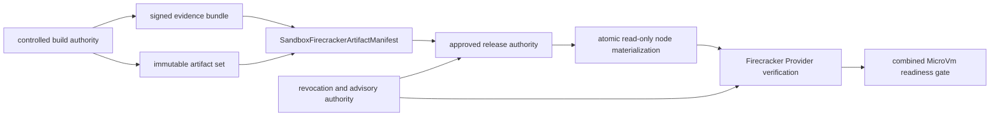

# ADR-20260729: Sandbox Firecracker Artifact Compatibility And Supply Chain

Status: proposed

Requirement: REQ-2026-0012

Owner: SDKWork Runtime Platform

Date: 2026-07-29

Specs: `ARCHITECTURE_DECISION_SPEC.md`, `SECURITY_SPEC.md`, `DEPLOYMENT_SPEC.md`, `RUNTIME_DIRECTORY_SPEC.md`, `SUPPLY_CHAIN_SECURITY_SPEC.md`, `OBSERVABILITY_SPEC.md`, `PERFORMANCE_SPEC.md`, `TEST_SPEC.md`

## Context

Firecracker Provider 的 `MicroVm` Assurance 依赖一个完整、可重现且未被替换的 VMM/Guest Artifact 组合。分别校验若干本地文件的 Hash 不能证明这些文件彼此兼容，也不能证明它们来自受信 Release、未被撤销并可安全回滚。运行时下载、`latest`、任意 Host Path 或由 Provider 临时构建镜像还会把发布权限、网络依赖和 Secret 暴露到高风险执行路径。

当前仓库没有 Artifact Release Authority、真实 Artifact、Linux KVM Node 或 Packaging 配置，因此只能先固化候选机器边界和人工决策，不能声称已经交付供应链或 Provider Runtime。

## Decision

1. 使用候选 `SandboxFirecrackerArtifactManifest` 作为 Firecracker/Jailer/Guest Kernel/RootFS/Guest Agent/可选 Initrd 的单一 Compatibility Tuple Authority。Manifest 字段使用 `sandbox_` 前缀，未知字段关闭失败。
2. Manifest 按 `linux-kvm-x86_64` 或 `linux-kvm-aarch64` 分离，发布后不可变并由独立 Release Authority 签名。禁止 Partial Tuple、跨 Architecture 重用和 Runtime Override。
3. 每个 Descriptor 固定 Role、Version、SHA-256、Size、Media Type 和 Opaque Release Reference；Manifest 同时固定最低 Host Kernel/KVM Requirement、Guest Boot Contract、RootFS Schema 与 Guest Agent Protocol Version。
4. 每个 Artifact 必须关联 Signature、Checksum、SBOM、Provenance、Source Revision、Build Workflow/Toolchain、License Record 与 Advisory Snapshot。Evidence 与 Release、Architecture、Package 和 Digest 不一致时关闭失败。
5. Artifact Publication/Revocation 归 Release Authority。Provider 只验证和消费；Service Host 只注入已批准的 Manifest Reference；Host Isolation Broker 只物化被授权的精确 Artifact Set；Kernel/Agents 不选择 Provider-private Artifact。任何边界都不能覆盖 Digest。
6. Provider、Broker 与 Service Host 禁止 Runtime Download、任意 URL、`latest`、Mutable Alias、Source Checkout Fallback、Automatic Image Build 和未校验本地 Artifact。
7. Artifact 原子物化到 Provider-private Runtime Root，使用最小 ACL 和只读 Regular File。Symlink、Hardlink、非原子替换、文件身份或 Metadata 变化均拒绝。验证必须在打开文件后、执行或挂载前完成，以防校验后替换。
8. Allocate 前固定 Manifest；Start 前重新校验 Manifest Signature、Artifact Digest/Evidence、Revocation/Advisory、Architecture 和 Runtime File Identity。Degraded Artifact Readiness 不允许 Allocate/Start。
9. Revoked Tuple、Critical Advisory 或 Unknown Advisory State 阻止新 Allocate/Start 和 Recovery。Active Allocation 只能进入经评审的 Drain/Quarantine 决策，不能继续参与新分配。
10. Rollback 只允许选择以前批准、未撤销且 Architecture 相同的精确 Manifest Digest；禁止重建回滚、Mutable Alias 和弱化 Compatibility。Rollback 全链路审计。
11. 公共 Surface 最多暴露 Manifest ID/Digest、Release Version、Architecture、Readiness、Safe Reason Code 与 Trace。Host Path、Download URL、Signature/Key Material、Build Credential、Guest Credential、Runtime Root、API Socket 和 microVM ID 保持 Provider-private。
12. Artifact Readiness 是 Firecracker 综合 Readiness 的必要非充分条件。它不替代真实 KVM、Jailer/Seccomp、cgroup、Network、Workspace Block Device、Fencing、Guest Agent、Cleanup 与 Tenant Residue Evidence。
13. 机器候选权威位于 `specs/sandbox-firecracker-artifact-compatibility.contract.json`，保持 `draft`、`implementationAuthorized: false` 和 `x-sdkwork-no-release-artifacts: true`，直到人工评审接受真实 Authority、Tuple 和运维流程。

## Supply-chain And Runtime View

Release Authority 负责发布和撤销；Provider 负责校验与消费。该边界不允许 Provider、Broker、Service Host、Kernel 或 Agents 获得镜像构建和发布权限。

## Alternatives

### 分别配置 Firecracker、Kernel 和 RootFS Path

拒绝。独立 Path 无法形成完整 Compatibility Tuple，容易混用版本、泄露 Host Layout 并绕过 Release Authority。

### Provider 启动时从 URL 下载最新 Artifact

拒绝。它引入 Mutable Alias、网络与 Registry Availability、Credential 泄露、TOCTOU 和不可重现 Rollback。

### 只验证 SHA-256，不要求 Signature/SBOM/Provenance/Advisory

拒绝。Hash 只能检测内容变化，不能证明发布者、来源、依赖、许可、漏洞状态或撤销决定。

### Artifact 校验通过即声明 MicroVm Ready

拒绝。供应链完整性不能证明 Runtime Isolation、Policy、Workspace、Fencing、Guest Readiness 或 Cleanup。

### 在当前 Windows 环境生成示例 Artifact 作为 Release Evidence

拒绝。Synthetic Fixture 可测 Parser，但不能替代受控构建、真实签名、真实 Linux KVM Boot 和发布运维证据。

## Consequences

收益：Artifact Compatibility、Integrity、Revocation 和 Rollback 有单一机器边界；Provider 保持高内聚；运行时不承担网络下载、镜像构建或签名密钥；错误不会静默降级 `MicroVm` Assurance。

成本：需要独立 Release/Key/Advisory Authority、不可变 Artifact Store、Node Materialization、Evidence Retention 和真实 KVM Matrix；Artifact 更新必须作为完整 Tuple 发布，不能替换单个文件；当前 Gate 0 不产生可运行 Provider。

## Verification

- Contract Test 验证 exact roles/tuple、Sandbox-prefixed fields、bounds、evidence、no-download/no-latest、read-only atomic staging、TOCTOU denial、revocation/rollback、readiness 与 ownership。
- 实现测试必须覆盖 Manifest/Descriptor Schema、Signature/Digest、Tamper/Truncation/Substitution、Wrong Architecture、Partial Tuple、Expired/Unknown Evidence、Symlink/Hardlink、file swap、Restart 和 no-network-fetch。
- Release Evidence 必须用真实 Tuple 在目标 Linux KVM Architecture 启动，运行 Guest Readiness/Command/Cleanup，并绑定 `sdkwork.artifact-evidence.schema.v1.json` Evidence、SBOM、Provenance、Signature、Checksum、Advisory Snapshot 与 Rollback Target。
- 公共命名、Artifact Authority、Key Custody、Distribution、License、Vulnerability Response、Node Drain/Quarantine 和 Rollback 必须由架构、安全、供应链和运维 Owner 人工批准。

## Supersedes / Superseded By

Supersedes: none.

Superseded by: none.
