# ADR-20260729: Sandbox Firecracker Network Isolation And Egress Policy

Status: proposed

Requirement: REQ-2026-0014

Owner: SDKWork Runtime Platform

Date: 2026-07-29

Specs: `ARCHITECTURE_DECISION_SPEC.md`, `APPLICATION_LAYERED_ARCHITECTURE_SPEC.md`, `SECURITY_SPEC.md`, `PRIVACY_SPEC.md`, `OBSERVABILITY_SPEC.md`, `PERFORMANCE_SPEC.md`, `EVENT_SPEC.md`, `RUNTIME_DIRECTORY_SPEC.md`, `TEST_SPEC.md`

## Context

Firecracker 提供 MicroVm 边界，但 Guest 网络仍可能访问 Cloud Metadata、Host Control Plane 或其他 Tenant。让 Provider 或特权 Broker 同时决定 Policy 和执行 Policy 会形成不受审查的双权威；只创建 netns/Tap 或只写规则而不回读验证，也不能证明有效隔离。DNS Rebinding、Redirect、IPv4/IPv6 差异、Stale Fencing、Partial Apply 和 Cleanup Residue 都可能绕过表面上的 Allowlist。

当前仓库没有 Network Policy Port、Firecracker Provider、Host Network Runtime 或真实 Linux KVM Evidence。本决策只固定候选 Policy/Mechanism 边界，不授权网络实现。

## Decision

1. L3/provider-neutral `SandboxNetworkPolicyPort` 是唯一 Policy Authority，签发 `SandboxNetworkPolicyGrant`；Firecracker L4 `SandboxNetworkIsolationPort` 只把 Grant 转换为受验证的 Host/Guest Network Mechanism。Provider、Broker、Guest 和 Caller 不得自行添加 Allow Rule。
2. Sandbox-owned Type 使用 `Sandbox` 前缀，字段使用 `sandbox_` 前缀并拒绝未知字段。Default Action 固定为 `DenyAll`；第一版只允许显式 DNS Resolution 与 Egress Connection Grant，不允许 Ingress、Port Forward、Ambient Host Network、Wildcard 或 Catch-all CIDR。
3. 每个 Runtime Binding 使用独立 Network Namespace 和 Tap，活动 Binding 不共享；禁止 Host Network Namespace、Host Loopback 和从业务 Identity 推导 Host Interface Name。
4. `sandbox_cloud_metadata`、`sandbox_host_control_plane`、`sandbox_tenant_lateral_traffic` 是不可覆盖的永久拒绝类。规则在 Allow 前执行，并在 DNS/Redirect 后逐地址重检；未知分类关闭失败。
5. DNS Grant 同时限制 Resolver 和 Domain Rule，Resolved Address 有界、Pinned 并防 Rebinding。Egress Grant 明确 Protocol、Destination、Port；Redirect、Dual-stack、Fragment/Malformed Packet 和 Existing Flow 服从当前 Revision/Expiry。
6. Grant 绑定 Tenant Scope Hash、Session、Binding、Provider、Fencing、Policy Revision/Fingerprint、Rules、时间、Nonce、Audience 和 Signature，要求 Replay/Revocation/Clock Validation。
7. Host Isolation Broker 只通过固定 `sandbox_prepare_network` 执行经授权的最小特权步骤，不接收任意 Shell、Path、Interface 或 Firewall Rule；Policy Authority 不下沉到 Broker。
8. Side Effect 前执行最高 Fencing Token、单调 Revision 和 Idempotency。Apply 使用 Stage -> Atomic Commit -> Active Revision/Fingerprint Readback -> Default/Permanent Denial Probe；全部成功后才 Network Ready。
9. Partial Apply 恢复 `DenyAll`；无法证明恢复、Cleanup 或 Residue Clear 时 Quarantine Binding/Node。Teardown 先 Revoke，再 Force DenyAll，后清理 Flow/Rule/Tap/Namespace并扫描残留。
10. Readiness 必须同时证明 Grant、Fencing、Namespace/Tap、Default Deny、DNS/Egress、永久拒绝、Revision 和 Prior Residue Clear；静态 Contract、Mock 或 netns 存在本身不构成 `MicroVm` Evidence。
11. Metric 只允许低基数 Provider/Operation/Outcome/Reason；Destination、Rule、Packet 和 Host-private Identity 不进入 Metric/普通 Log。每个 Denial 和 Policy Change 产生 Durable Audit，Telemetry Failure 不得丢失。
12. 机器候选权威为 `specs/sandbox-firecracker-network-isolation.contract.json`，保持 `draft`、`implementationAuthorized: false` 与 no-runtime/netns/firewall/Tap 标记，直到完成人工评审和真实 KVM Evidence。

## Ownership View

```mermaid
flowchart LR
    C["authorized Sandbox capability request"] --> P["SandboxNetworkPolicyPort"]
    P --> G["signed SandboxNetworkPolicyGrant"]
    G --> S["Sandbox service orchestration"]
    S --> N["SandboxNetworkIsolationPort L4 adapter"]
    N --> B["Host Isolation Broker sandbox_prepare_network"]
    B --> F["per-binding netns Tap and policy"]
    F --> V["readback probes and readiness"]
    V --> Q["teardown residue clear or quarantine"]
```

Policy Authority、编排、特权机制与验证各自单一职责；Grant 是跨边界授权事实，Host-private 标识不反向进入公共模型。

## Alternatives

### 由 Firecracker Provider 自行决定出口

拒绝。Provider 只拥有机制，不拥有 Tenant/Platform Policy；否则不同 Provider 会产生不一致授权语义并绕过审计。

### 让 Host Isolation Broker 接受任意 nftables 命令或规则文本

拒绝。任意 Shell/Rule/Interface 输入把最小特权 Broker 变为通用 Root Network Helper，无法建立稳定授权和审计边界。

### 只创建 Network Namespace 和 Tap 即报告 Ready

拒绝。Namespace 不等于 Policy；必须验证 Default Deny、永久拒绝、Revision/Fingerprint 和实际 Effective State。

### 显式 Grant 可覆盖 Metadata 或 Host Control Plane

拒绝。高风险内部目标不能由业务请求提升；它们必须先于 Allow Rule 且在 Resolution/Redirect 后重检。

### Partial Apply 后保留旧/新规则混合并重试

拒绝。混合状态无法证明授权边界；必须原子 Commit，失败恢复 DenyAll，否则 Quarantine。

## Consequences

收益：Policy 与机制高内聚低耦合；每个 Binding 独立；永久拒绝、Revision/Fencing、原子验证和残留隔离可审计；Local/Firecracker 不需要在 Kernel 中分支。

成本：需要 Policy Issuer/Revocation/Clock Authority、Node Address Classification、DNS/Egress Compiler、Host Broker 最小权限、Durable Journal、真实双栈 KVM Test、Quarantine Capacity 和运维 Runbook；当前 Gate 0 不提供网络能力。

## Verification

- 静态 Contract Test 验证 Policy/Mechanism Ownership、Sandbox 命名、DenyAll、Grant、永久拒绝、Namespace/Tap、Fencing/Revision、Atomic Apply/Verify、Readiness、Teardown/Quarantine、Telemetry/Audit 与 Bounds。
- Runtime Test 必须覆盖 Signature/Expiry/Replay/Revocation、DNS Rebinding、Redirect、Dual-stack、Metadata/Host/Tenant Lateral Denial、Concurrent Revision、Stale Fencing、Partial Apply、Restart、Residue 和 Audit Backpressure。
- 真实 Linux KVM Matrix 证明 Default Deny 与显式 Allow 的 Effective Behavior，并在 Destroy 后通过 Cross-tenant Residue 和 Node Reuse Gate。
- 公共命名、Policy Authority、Privilege、Permanent Denials、Audit/Privacy、Node Operations 和 `MicroVm` Claim 需要人工评审。

## Supersedes / Superseded By

Supersedes: none.

Superseded by: none.
