# ADR-20260729: Sandbox Firecracker Resource Isolation And Usage Facts

Status: proposed

Requirement: REQ-2026-0015

Owner: SDKWork Runtime Platform

Date: 2026-07-29

Specs: `ARCHITECTURE_DECISION_SPEC.md`, `APPLICATION_LAYERED_ARCHITECTURE_SPEC.md`, `SECURITY_SPEC.md`, `PRIVACY_SPEC.md`, `PERFORMANCE_SPEC.md`, `OBSERVABILITY_SPEC.md`, `EVENT_SPEC.md`, `RUNTIME_DIRECTORY_SPEC.md`, `TEST_SPEC.md`

## Context

Firecracker Machine Config 只限制 Guest 可见 vCPU/Memory，不限制 Host 上 VMM/Jailer Process Tree 的 CPU、Memory、PID 与 IO；只创建 cgroup 而不验证 Controller、Effective Value 和 Process Membership 同样不能证明隔离。若 Provider 或 Broker 自行决定 Limit，会绕过 Tenant/Platform Quota；若 Metric 直接作为账单事实，则采样丢失、重启和标签聚合会污染商业权威。

当前仓库没有 Resource Policy Port、cgroup Runtime、Usage Collector、Quota Engine 或 Commerce Adapter。REQ-2026-0016 已形成 Admission/Node Inventory/Scheduler/PostgreSQL Capacity Reservation 的 draft Gate 0，但没有对应 Runtime 或数据库实现。本决策只固定候选 Policy/Mechanism/Usage Fact 边界，不授权实现。

## Decision

1. L3/provider-neutral `SandboxResourcePolicyPort` 是 Resource/Quota Policy Authority并签发 `SandboxResourceLimitGrant`；Firecracker L4 `SandboxResourceIsolationPort` 只执行机制和测量。Provider/Broker 不扩大 Limit，Caller 请求不自动授权。
2. Sandbox-owned Type 使用 `Sandbox` 前缀，字段使用 `sandbox_` 前缀并拒绝未知字段。固定 Operation 为 Prepare、Apply、Verify、Sample、Release。
3. Grant 绑定 Tenant/Session/Binding/Provider/Fencing/Policy Revision/Fingerprint、Guest Shape、CPU/Memory/PID/IO Limit、`sandbox_admission_grant_id`、`sandbox_capacity_reservation_id`、`sandbox_capacity_reservation_fingerprint`、时间、Nonce、Audience 和 Signature；验证 Ceiling、Reservation Resource Vector、Replay、Revocation 和 Clock。
4. Limit 必须显式、有限、正值且不超过 Tenant/Platform Ceiling 或 Node Reservation。第一版不支持 Live Guest vCPU/Memory Resize；Shape Change 创建新 Binding。
5. Host 使用 cgroup v2 Unified Hierarchy 和 `cpu`/`memory`/`pids`/`io` Controller；禁止 v1/hybrid fallback、任意 Path、活动 Binding 共享 Scope 和 Foreign Process。
6. 每个 Binding 使用独立 Leaf Scope。Jailer、VMM 和 Descendant 在 Guest 执行前进入 Scope；Readiness 回读 Membership，不能容忍短暂无限制执行或 Descendant Escape。
7. Firecracker vCPU/Memory 精确匹配 Grant；Host Memory Ceiling 覆盖 Guest Memory + VMM Overhead。Machine Config 与 cgroup Effective Value 必须共同读回验证。
8. CPU 使用 finite Quota/Period/Weight；Memory 使用 High/Max/OOM Group 且 Swap 默认 0；PID 使用 finite Max；IO 按 Logical Device Role 限制，Host Device Identity 保持 L4/Host Broker 私有。Disk Capacity 仍由 Workspace/Storage Contract 拥有。
9. Side Effect 前验证 Grant/Fencing/Revision/Reservation；同 Operation/Fingerprint Replay，不同 Fingerprint Conflict。Partial Apply 回滚或 Quarantine；所有 Readiness Dimension 通过前不能 Start Guest 或报告 Ready。
10. Limit Breach 使用 typed Outcome。CPU/IO Throttle 可观察，Memory OOM/PID Exhaustion 有明确 Operation/Session 结果；禁止 Host OOM、无限 Retry 或静默改变 Tool Semantics。
11. Provider Boundary 输出 immutable、Binding-scoped、Sequence-monotonic `SandboxResourceUsageFact`；同一 Binding Counter 不重置，Scope Release 前产生 Final Fact并通过 Durable Handoff。
12. Sandbox 聚合 Usage Fact但不拥有 Price/Invoice/Payment；Commerce 只消费批准的不可变事实。Metric 是低基数运营观测，不是 Billing Truth。
13. Release 先停止 Process、Final Sample、验证 Empty Scope、移除 Scope、Residue Scan。Unknown/Failure Quarantine Binding/Node，阻止跨 Tenant 重用。
14. 机器候选权威为 `specs/sandbox-firecracker-resource-isolation.contract.json`，保持 `draft`、`implementationAuthorized: false` 和 no-runtime/cgroup/quota-engine/billing 标记。

## Ownership View

```mermaid
flowchart LR
    I["authorized runtime resource intent"] --> P["SandboxResourcePolicyPort"]
    P --> G["signed SandboxResourceLimitGrant"]
    G --> S["Sandbox service orchestration"]
    S --> R["SandboxResourceIsolationPort L4 adapter"]
    R --> B["Host Broker sandbox_apply_resource_limits"]
    B --> C["Firecracker shape and per-binding cgroup v2"]
    C --> V["effective-state and membership verification"]
    V --> U["immutable SandboxResourceUsageFact"]
    U --> A["Sandbox durable aggregation"]
    A --> M["approved Commerce metering consumer"]
```

Policy、机制、测量、聚合和 Commerce 各有单一权威；Host-private Metadata 与 Billing Model 不进入相邻层。

## Alternatives

### 只使用 Firecracker Machine Config

拒绝。它不能限制 Host VMM/Jailer Process Tree、PID 或 Block IO，也不能证明 Host Capacity 隔离。

### 只创建 cgroup 文件而不读回 Membership/Effective Value

拒绝。配置意图不是执行证据；Controller 缺失、Inheritance、Process Escape 或 Partial Write 都可能留下无界工作负载。

### 由 Provider 或 Broker 决定默认资源值

拒绝。机制层不拥有 Tenant/Plan/Quota Policy，默认值会形成不可审计的隐式授权和跨 Provider 漂移。

### 使用 Metric 直接计费

拒绝。Metric 可采样、聚合、丢弃和重置；计费输入必须是 immutable、idempotent、durably handed-off Usage Fact。

### Cleanup 失败后继续复用 Node Scope

拒绝。Residual Process/Controller/Counter State 会污染后续 Tenant 的隔离和用量，必须 Quarantine。

## Consequences

收益：Quota Policy 与 Host Mechanism 解耦；Guest/Host 双层限制可验证；OOM/PID/IO 失败语义稳定；Usage 与 Billing 权威分离；Node Residue 关闭失败。

成本：需要 REQ-2026-0016 Admission/Scheduler/PostgreSQL Capacity Reservation Authority、cgroup Delegation、VMM Overhead Model、Device Role Resolver、Durable Usage Pipeline、Commerce Contract、真实 KVM/压力/故障注入和 Quarantine Capacity；当前 Gate 0 不提供资源执行或调度能力。

## Verification

- 静态 Contract Test 验证 Ownership、Sandbox 命名、finite Limit、cgroup v2、Machine Config、Controller、Fencing/Readback、Usage Fact、Cleanup/Quarantine、Telemetry/Audit 与 Bounds。
- Runtime Test 覆盖 Admission/Reservation Binding、Grant/Ceiling/Reservation Race、Limit-not-above-Reservation、Controller Missing、CPU/Memory/PID/IO、Process Escape、Partial Apply、Stale Fencing、Restart、Final Usage、Counter Continuity、Durable Handoff 和 Residue。
- 真实 Linux KVM Test 证明 Guest Shape + Host cgroup 双重限制、VMM Overhead、Host Stability、采样开销、typed Outcome 与 Cross-tenant Reuse Gate。
- 公共命名、Quota/Capacity/Commerce Ownership、Host Privilege、Usage Retention 和 `MicroVm` Claim 必须完成人工评审。

## Supersedes / Superseded By

Supersedes: none.

Superseded by: none.
