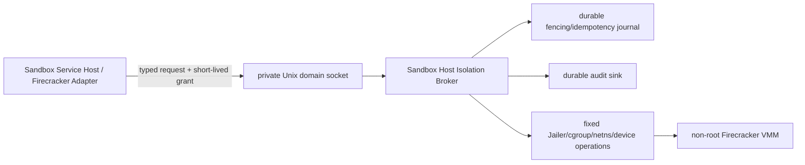

# ADR-20260729: Sandbox Host Isolation Broker Boundary

Status: proposed

Requirement: REQ-2026-0011

Owner: SDKWork Runtime Platform

Date: 2026-07-29

Specs: `ARCHITECTURE_DECISION_SPEC.md`, `APPLICATION_LAYERED_ARCHITECTURE_SPEC.md`, `COMPONENT_SPEC.md`, `INTERNAL_API_SPEC.md`, `SECURITY_SPEC.md`, `RUNTIME_DIRECTORY_SPEC.md`, `OBSERVABILITY_SPEC.md`, `EVENT_SPEC.md`, `PERFORMANCE_SPEC.md`, `SUPPLY_CHAIN_SECURITY_SPEC.md`, `RUST_CODE_SPEC.md`, `TEST_SPEC.md`

## Context

Firecracker/Jailer、cgroup v2、Network Namespace/Tap、Workspace Block Device 与 Runtime Directory 准备需要受限 Host 特权。若普通 Firecracker Adapter 直接持有 root/sudo、任意 `Command`、Host Path、Device 或 Network 权限，Provider compromise 将直接变成 Host compromise，也无法证明 `MicroVm` Assurance 的最小特权边界。

该边界不能退化为通用 privileged helper，也不能通过公共 HTTP/RPC 暴露。它必须只接受 Sandbox-owned typed request，以本地强认证、短期授权、Fencing、Idempotency、Audit 和有界 Cleanup 把特权副作用限制在一个可审计面。

## Decision

1. 定义候选 `SandboxHostIsolationBroker` L4 Infrastructure Adapter Port；未来候选 Component 名称为 `sdkwork-sandbox-host-isolation-broker`。命名与 Component 创建必须经人工评审，本 ADR 不授权实现。
2. Broker 只实现机器契约列出的八个固定操作。协议不包含任意 Shell、Executable、Host Path、Device Path、Environment Map、Sudo Argument 或自由文本命令。
3. Broker 与 Firecracker Adapter 仅通过 Provider-private Runtime Directory 下的 Linux Unix Domain Socket 通信；禁止 TCP、Remote Network 和公共 HTTP/RPC。Socket ACL、peer credential、client executable identity 与协议版本必须同时验证。
4. 每个请求携带短期 `SandboxHostIsolationGrant`。Grant 由受信 Control/Composition Authority 签发，绑定 Audience、Runtime Binding、Provider、Request Fingerprint、Allowed Action、Policy Revision、Nonce、Issue/Expiry 和 Signature；过期、撤销、重放、Audience/Binding/Provider/Action 不匹配或时钟不确定均关闭失败。
5. Broker 是独立受审计 Host Service，运行 Privilege Profile 和 effective Linux capabilities 必须显式 allowlist；禁止 Ambient Capability、Docker Socket、Cloud Credential 和不受限 Host Mount。Firecracker VMM 必须以专用非特权 UID/GID、Jailer Chroot/Seccomp、最小 `/dev/kvm` 权限运行，不得以 root 运行。
6. Provider Control State 仍拥有业务 Binding/Fencing Authority；Broker 作为特权副作用防线，按 Binding 原子记录已接受的最高 Fencing Token、Operation ID 和 Request Fingerprint，在任何 Host Side Effect 前拒绝 Stale/Conflict，并在 Broker restart 后恢复。
7. Broker 只接收验证后的 Opaque Artifact Set、Workspace Attachment、Network Policy Grant、Resource Limit Grant 与 Target Identity Reference。Workspace 操作遵循 Block Device ADR，Network 操作遵循 Network Isolation ADR，`sandbox_apply_resource_limits` 遵循 `ADR-20260729-sandbox-firecracker-resource-isolation-and-usage-facts`，只执行经过 Policy Revision/Fencing/Capacity Reservation 绑定的 L4 cgroup/Machine Config Step。Broker 不决定 Workspace/Storage/KMS、Network Policy、Quota/Capacity Policy、Usage Aggregation 或 Commerce Billing。解析出的 Host Path、Socket、Tap、Firewall Handle、cgroup、PID、Device 和 microVM identity 保持 Broker/Provider-private。
8. `SandboxHostIsolationBrokerReadiness` 同时验证 Protocol、Peer、Grant、Privilege Profile、Runtime Directory、Fencing Store、Audit Sink 和 Cleanup Reconciliation。任一必需项不 Ready 时不授权 Side Effect，也不通过 Local/Docker 或弱 Provider 回退。
9. 相同 Operation ID + Fingerprint 返回幂等结果；相同 Operation ID + 不同 Fingerprint 返回 Conflict。Deadline、Message、Grant TTL、Cleanup Step、Reconciliation Batch 和 Retry 全部有界。
10. 每个 Side Effect 产生 durable `SandboxAuditRecord`，每个 Denial 产生 Security Fact，并传播 Server-owned Trace。Audit 不依赖普通 Log 或 Telemetry Exporter。
11. Broker 不拥有 Sandbox Lifecycle/Provider Selection Policy、Workspace Business Ownership、Scheduler、Node Enrollment、Secret/KMS、Billing、Public API/SDK、Deployment Profile 或 Artifact Build；这些由各自 Requirement/Composition/Operations Authority 拥有。
12. 实现前必须完成 Threat Model、Protocol Compatibility、Privilege Diff、Peer Spoofing、Grant Replay/Revocation、Fencing Restart、Arbitrary Input Negative、Cleanup Fault、Audit Redaction、真实 Linux KVM、Supply-chain 和 Install/Upgrade/Rollback Evidence。

## Runtime And Security View

## Alternatives

### Firecracker Adapter 直接以 root 运行

拒绝。它把 Provider 解析、业务流程和 Host 特权合并，扩大攻击面，并让任何 Adapter 漏洞获得任意 Host 权限。

### 通用 sudo/Command Helper

拒绝。自由 Shell、Executable、Argument 或 Host Path 无法形成稳定 Capability Boundary，也无法完成精确 Fencing、Idempotency 和 Audit。

### 通过 TCP/HTTP 暴露 Broker

拒绝。Broker 是 Node-local privilege boundary；网络暴露增加认证、攻击面、部署和租户边界，不属于 Internal API。

### 仅依赖 Filesystem Permission，不使用签名 Grant

拒绝。Peer identity 只能证明调用进程，不能证明具体 Binding、Action、Fencing Token、Policy Revision、Expiry 或 Request Fingerprint 已获授权。

### 只在 Provider 保存 Fencing，不在 Broker 防御

拒绝。受损或过期 Provider Process 仍可能调用特权副作用。Broker 必须在执行点拒绝 Stale/Conflict，同时不取代业务 Fencing Authority。

## Consequences

收益：Host 特权被限制在固定、可审计、可授权、可撤销和可恢复的操作面；普通 Adapter/VMM 保持非特权；Fencing、Idempotency、Audit 和 Cleanup 在实际 Side Effect 边界再次强制执行。

成本：需要独立协议、Grant Authority、Fencing Journal、Audit Sink、Linux Service Hardening、Package/Upgrade/Rollback、兼容性和真实 KVM 故障测试；Broker 本身成为关键安全组件，必须维护供应链和漏洞响应。

## Verification

- Contract Test 验证固定操作、typed/prefixed fields、Local-only IPC、Grant、Privilege、Fencing、Idempotency、Readiness、Bounds、Audit 和 forbidden inputs/outputs。
- Static checks 验证没有 Broker crate、runtime entrypoint、config key、HTTP/RPC/API/SDK、service unit 或 privileged implementation。
- 实现阶段必须运行 Peer Spoofing、Grant Expiry/Replay/Revocation、Stale Fencing、Restart Recovery、Privilege Diff、Shell/Path/Device Negative、Cleanup Fault、Audit Redaction 和真实 Linux KVM End-to-end Test。
- Security/Architecture/Platform Operations/Workspace/Audit/Supply-chain/Release Human Review 全部批准前 ADR 保持 `proposed`。

## Supersedes / Superseded By

Supersedes: none.

Superseded by: none.
