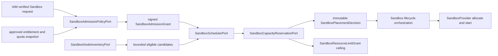

# ADR-20260729: Sandbox Multi-tenant Admission, Scheduling And Capacity Reservation

Status: proposed

Requirement: REQ-2026-0016

Owner: SDKWork Runtime Platform

Date: 2026-07-29

Specs: `ARCHITECTURE_DECISION_SPEC.md`, `APPLICATION_LAYERED_ARCHITECTURE_SPEC.md`, `SECURITY_SPEC.md`, `PRIVACY_SPEC.md`, `DATABASE_SPEC.md`, `PERFORMANCE_SPEC.md`, `OBSERVABILITY_SPEC.md`, `EVENT_SPEC.md`, `DEPLOYMENT_SPEC.md`, `TEST_SPEC.md`

## Context

当前 `SandboxLifecycleService::select_sandbox_provider` 只在进程内按 Capability、Assurance 和 Provider Health 选择第一个合格 Provider，适合 Phase 0 行为验证，但不能证明 SaaS Tenant Quota、Node Capacity、Locality、Residency、Fairness 或多副本并发安全。REQ-2026-0015 又要求 Resource Grant 必须有 Node Capacity Reservation；若 Scheduler 只读剩余容量再调用 Provider，并发 Start 会超卖 Node。若 Provider、Host Broker 或 Node Agent 自行做 Admission，则会绕过 Tenant/Commerce Policy 并产生多个权威。

本决策只固定候选 Admission、Inventory、Scheduler、Capacity Reservation 与 Lifecycle 组合边界，不授权实现。

## Decision

1. L3 `SandboxAdmissionPolicyPort` 消费 IAM Typed Verified Context 和批准的 Entitlement/Quota Snapshot；它原子预留 Tenant 并发配额并签发短期 `SandboxAdmissionGrant`。读取配额但不预留不构成 Admission。
2. L3 `SandboxNodeInventoryPort` 只从 REQ-2026-0017 Control Plane 签发的 `SandboxVerifiedNodeInventoryRecord` 投影版本化、短期 `SandboxNodeCandidateSnapshot`。Node Reference 保持 Opaque；Scheduler 不得直接消费 Node Agent Publication，Enrollment、Machine Identity、Attestation Verification、Inventory Publication 和 Lifecycle Control 分属 REQ-2026-0017 的独立权威。
3. L3 `SandboxSchedulerPort` 只拥有 Placement Policy：先硬过滤 Capability、OS、Architecture、Assurance、Locality/Residency、Policy、Anti-affinity、Health 和 Capacity，再在有界集合中确定性排序。它不拥有身份、Entitlement、Quota Ledger、Provider Mechanism 或 Node Enrollment。
4. L3 `SandboxCapacityReservationPort` 在 PostgreSQL 权威状态中原子预留 Node Resource Vector。第一版禁止 Overcommit、负 Capacity、跨 Binding 共享 Reservation 和 Provider Allocate-before-Reservation。
5. L2 Sandbox Scheduling Orchestration 按 Admission -> Inventory -> Placement Candidate -> Atomic Reservation -> Placement Decision 顺序组合 Ports；任何阶段失败均不得调用 Provider。
6. `SandboxPlacementDecision` 绑定 Admission Grant、Capacity Reservation、Session、Runtime Binding、Provider、Opaque Node、Policy/Inventory Revision、Resource Vector、Fingerprint 与 Expiry，并保持 immutable。
7. REQ-2026-0015 `SandboxResourceLimitGrant` 绑定 Admission Grant、Capacity Reservation ID/Fingerprint，且 Limit 不得超过 Reservation。Provider/Broker 只验证和执行，不扩大 Reservation。
8. Cloud Quota/Capacity Authority 使用 PostgreSQL；原子扣减使用唯一约束、CAS、显式锁或更强事务保证。锁顺序稳定，Serialization/Deadlock 只重试完整幂等事务并有界退避；禁止跨远程调用持锁。
9. Operation + Fingerprint 提供 Replay/Conflict，Fencing Token 在每个 Mutating Side Effect 前验证。Admission、Reservation、Placement 和 Binding 不能出现双重活动所有权。
10. Allocate/Start 失败、Stop/Destroy、Expiry 和 Recovery 释放、替换或 Quarantine Reservation。Prepared Expiry 与 Confirmed Orphan 由 Tenant-leading、有界分页 Reconciler 处理；容量不确定时 Node Quarantine。
11. Priority 只能来自 Admission Grant；Scheduler 实施 Tenant-aware Fairness、Queue Deadline 和 Starvation Detection。Caller 或 Adapter 不能提升 Priority 或绕过配额。
12. Admission/Scheduling Error 使用关闭 Taxonomy、显式 Retryability 和有界 Retry-after；公共错误、Event、Metric、Log 不暴露 Raw Capacity、Node/Topology、其他 Tenant 或 Entitlement Payload。
13. Admission Denied、Placement Selected/Failed 与 Capacity Reserved/Released 注册到现有 Event Catalog；Admission、Placement、Queue、Reservation 和 Saturation Metric 使用低基数维度，不成为 Quota/Capacity/Billing Authority。
14. REQ-2026-0018 及 `specs/sandbox-quota-and-capacity-persistence.contract.json` 细化 PostgreSQL 四对象模型、SQL Subject Migration Gate、全局锁序、TTL/Quarantine、RLS/Role 与 PITR/RPO/RTO；它保持 Draft 且不授权 Table/Migration/Repository。
15. `specs/sandbox-multi-tenant-scheduling.contract.json` 是候选调度机器权威，保持 `draft`、`implementationAuthorized: false` 与 no-runtime/scheduler/database/node-agent/pool/commerce 标记。Warm Pool、Preemption、Autoscaling、GPU 和跨 Region 调度分别由后续 Requirement 决定。

## Ownership View

身份/Entitlement、Admission、Inventory、Placement、Capacity、Lifecycle、Provider 和 Resource Enforcement 各有单一权威。

## Alternatives

### 在 Lifecycle Service 中继续选择第一个健康 Provider

拒绝。该算法没有跨副本共享容量、Tenant Quota、Locality、Fairness 或原子 Reservation，不能满足 SaaS 容量安全。

### 让 Provider 或 Host Broker 自行 Admission

拒绝。机制层没有 IAM/Entitlement/Quota 权威，会导致 Provider-specific Policy、配额漂移和不可审计的优先级提升。

### 读取剩余容量后直接 Allocate

拒绝。Read-check 与 Allocate 之间存在 TOCTOU，并发请求可超卖同一 Node；必须先原子 Reservation。

### 用 Redis 或 Process Memory 作为 Cloud Capacity Truth

拒绝。当前没有已批准的 Redis 一致性/恢复模型；Process Memory 无法跨副本、崩溃恢复或提供 PostgreSQL Release Evidence。未来替代 Authority 必须通过独立 ADR。

### 把 Warm Pool 同时纳入第一版 Scheduler

拒绝。Pool 需要独立的跨 Tenant Residue、Image Compatibility、Refresh、Drain 与 Reuse Gate；该边界现由 REQ-2026-0019、ADR-20260730 和 `specs/sandbox-runtime-pool.contract.json` 管理，仍不是本 Scheduler Requirement 的实现范围。

## Consequences

收益：Tenant Quota 与 Node Capacity 都在 Provider Side Effect 前原子占用；Provider-neutral Lifecycle 保持稳定；Placement 不能弱化 Assurance；多副本并发、Fairness、故障恢复和商业容量事实可审计。

成本：需要 IAM/Commerce Policy 输入、REQ-2026-0017 Node Trust/Enrollment/Attestation/Verified Inventory、REQ-2026-0018 SQL Subject Migration 与 PostgreSQL Quota/Capacity Persistence、Scheduler/Admission L3 Port、L2 Orchestration、Fairness Algorithm、Reconciler、真实规模与故障测试；当前 Gate 0 不提供调度或数据库能力。

## Verification

- 静态 Contract Test 验证 Authority、Sandbox 命名、Atomic Admission、Hard Filter、Node Eligibility、PostgreSQL Reservation、Resource Binding、Fencing/Idempotency/Recovery、Error/Bounds、Event/Metric 和 Privacy。
- Runtime Test 必须证明 PostgreSQL Transaction/Lock/CAS/Deadlock Retry、Multi-replica Quota/Capacity Race、Tenant Fairness、Stale Inventory、Drain/Quarantine、Provider Failure、Orphan Reservation 和 PITR Recovery。
- Firecracker Matrix 必须证明 Reservation-before-Allocate、Limit-not-above-Reservation、Node Loss/Recovery 和 Cross-tenant Isolation。
- 公共命名、IAM/Commerce/Quota Ownership、Node Trust、PostgreSQL Data Model、Fairness、Security/Privacy、Production Topology 与 Release 必须完成人工评审。

## Supersedes / Superseded By

Supersedes: none.

Superseded by: none.
