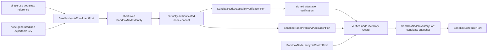

# ADR-20260729: Sandbox Node Trust, Enrollment, Attestation And Verified Inventory

Status: proposed

Requirement: REQ-2026-0017

Owner: SDKWork Runtime Platform

Date: 2026-07-29

Specs: `ARCHITECTURE_DECISION_SPEC.md`, `APPLICATION_LAYERED_ARCHITECTURE_SPEC.md`, `SECURITY_SPEC.md`, `PRIVACY_SPEC.md`, `DEPLOYMENT_SPEC.md`, `CONFIG_SPEC.md`, `SUPPLY_CHAIN_SECURITY_SPEC.md`, `OBSERVABILITY_SPEC.md`, `EVENT_SPEC.md`, `PERFORMANCE_SPEC.md`, `DATABASE_SPEC.md`, `TEST_SPEC.md`

## Context

REQ-2026-0016 要求 `SandboxNodeInventoryPort` 提供受信、版本化、短期 Node Snapshot，但当前没有 Enrollment、Machine Identity、Attestation Verification、Inventory Publisher、Drain/Quarantine 或 Revocation Authority。仅用 Node Agent 自报 Heartbeat、静态 Token 或 mTLS Certificate 不能证明 KVM、Artifact、Kernel、Policy、Health 和 Capacity 的 Effective State；把普通身份认证称为 Hardware Attestation 又会制造虚假安全保证。并发 Scheduler 若直接消费未验证自报 Capacity，还会把受攻击或过期 Node 放入 Placement。

本决策只固定候选 Node Trust Control Plane 与 Node Agent Publication 边界，不授权实现。

## Decision

1. L3 `SandboxNodeEnrollmentPort` 拥有 Bootstrap-to-Identity Workflow；Bootstrap Credential 短期、单次、只以 Reference 表达，Node 生成并证明持有不可导出 Key，Control Plane 分配 Opaque `sandbox_node_reference`。Node/Caller 不指定 Trust Profile、Node Reference 或 Capability。
2. `SandboxNodeIdentity` 是短期、Key-bound、Trust-domain/Audience-bound Workload Identity。steady-state Transport 使用 TLS 1.3 或更强的双向认证，验证双方 Identity、Trust Bundle Revision、Expiry 与 Revocation；禁止永久 Certificate、共享/Wildcard Identity、静态 Bearer Token 和 Source Config 中的 Certificate/Private Key。
3. Machine Authentication 与 Platform Attestation 分离。`sandbox_authenticated_machine_identity` 只证明当前 Key/Trust Domain；`sandbox_verified_platform_attestation` 还需要独立 Verifier 对 Fresh Nonce、Evidence Chain、Node Key、Boot/Kernel Measurement、Artifact Manifest、Policy Revision、Approved Baseline 和 Expiry 的验证。Node Agent、Provider、Broker 或 Scheduler 不能提升 Trust Profile。
4. L3 `SandboxNodeAttestationVerificationPort` 输出 immutable、signed `SandboxNodeAttestationVerification`。Replay/Stale/Unknown Evidence 和 Failed/Unknown Outcome 关闭失败；Raw Quote/Event Log/PCR/Vendor Evidence 保留在受控 Verifier Boundary，不进入公共 Contract/Event/Metric/Error。
5. L3 `SandboxNodeInventoryPublicationPort` 接受 Active Identity 签名、严格单调 Sequence、短 TTL、有限 Capability/Assurance/Capacity、有效 Attestation、Artifact/Network/Resource Revision、Health、Lifecycle、Locality/Residency/Fault Domain 与 Capacity Revision。Node Agent 是 Claimant/Publisher，不是 Scheduler Authority。
6. Sandbox Control Plane 绑定 Identity、Attestation、Inventory、Artifact、Policy、Health 与 Capacity Revision并签发 `SandboxVerifiedNodeInventoryRecord`。REQ-2026-0016 `SandboxNodeInventoryPort` 只从该 Verified Projection 形成 `SandboxNodeCandidateSnapshot`；禁止 Scheduler 直接消费 Agent Publication。
7. L3 `SandboxNodeLifecycleControlPort` 固定 Pending Enrollment、Enrolled、Attesting、Active、Draining、Quarantined、Revoked、Expired。只有 Active 且证据新鲜的 Node 可调度；Drain 先阻止新 Placement，Quarantine 阻止新旧 Side Effect，Revocation/Expiry 立即阻止认证与 Placement。
8. Identity Rotation 必须证明新 Key Possession，最多两个 Identity 短期重叠并撤销旧 Identity。Compromise、重复 Active Key 或 Clone Detection 同时 Quarantine 相关 Node并撤销 Identity；Restart 不得重用 Bootstrap Credential。
9. Enrollment/Rotation/Attestation/Inventory/Drain/Quarantine/Revocation 使用 Operation + Fingerprint Replay/Conflict、Revision/CAS、有界 Retry/Timeout/Batch。Stale Revision 拒绝，有界 Reconciler 不执行全 Node Scan。
10. Error 使用关闭 Taxonomy和安全 Retry-after。Node Trust 数据分类为 `InternalSecuritySensitive`；Public API/Event/Metric 不暴露 Node Identity、Certificate、Serial、Thumbprint、Raw Evidence、Host Address、Topology、Measurement 或 Capacity，Audit 使用 Opaque/Hashed Reference。
11. Enrollment/Identity/Trust/Inventory/Drain/Quarantine Event 进入既有 Event Catalog；Metric 只使用有界 Trust Profile、Lifecycle/Scheduling State、Operation、Outcome 和 Failure Category。Event/Metric 不是 Identity、Attestation 或 Inventory Authority。
12. `specs/sandbox-node-trust-and-inventory.contract.json` 是候选机器权威，保持 `draft`、`implementationAuthorized: false` 和 no-node-agent/pki/attestation-verifier/database/runtime/deployment 标记。Local Provider 不要求 Node Enrollment；Cloud Firecracker 必须满足该 Gate。

## Trust Flow

Identity、Attestation、Inventory Verification、Lifecycle Control 与 Placement 各有单一权威；Node Agent 只证明 Key Possession、提交 Evidence 和发布受限 Inventory。

## Alternatives

### 使用长期静态 Token 或 Certificate 注册 Node

拒绝。长期共享 Credential 难以证明单 Node Key Possession、轮换、撤销和 Clone，泄露后影响窗口无界。

### 把 mTLS 成功解释为 Hardware Attestation

拒绝。mTLS 证明 Identity Key 与 Trust Domain，不证明 Boot、Kernel、KVM、Artifact 或 Policy Effective State；Trust Profile 必须分离。

### Scheduler 直接消费 Node Agent Heartbeat

拒绝。自报 Capability/Capacity/Health 没有 Control-plane Verification、Revision Binding 和 Revocation Gate，受攻击或过期 Node 可进入 Placement。

### Node 不健康时只降低打分

拒绝。Stale、Draining、Quarantined、Revoked、Expired 或 Trust Unknown 是硬约束，不是评分项。

### 把原始 Attestation Quote 和 PCR 放入 Event 方便排障

拒绝。Raw Evidence 可暴露 Platform/Boot/Kernel 细节且具有高基数；只允许受控 Verifier Store 与安全摘要/Outcome。

## Consequences

收益：Scheduler 只消费可验证且短期的 Node Authority；mTLS 与 Attestation Claim 不混淆；Identity Clone、过期 Inventory、Drain/Quarantine 和 Compromise 关闭失败；Firecracker Node Trust 可审计并支持安全轮换。

成本：需要 Machine Identity/PKI/HSM、Node Agent Package、Attestation Verifier/Baseline、PostgreSQL Trust/Inventory Store、Control-plane Projection、Rotation/Revocation、Incident Runbook、真实 Linux KVM 和多副本故障测试；当前 Gate 0 不提供任何 Node Runtime。

## Verification

- 静态 Contract Test 验证 Authority、Sandbox 命名、Bootstrap、Workload Identity/mTLS、Authentication-vs-Attestation、Verified Inventory、Scheduler Binding、Rotation/Revocation、Drain/Quarantine、Recovery、Error/Privacy/Bounds 和 Event/Metric。
- Runtime Test 必须证明 PostgreSQL Authority、Single-use Bootstrap、Proof-of-possession、TLS 1.3 mutual auth、Trust Bundle/Certificate Rotation/Revocation、Clone Detection、Attestation Freshness/Baseline、Inventory Sequence/TTL、Drain/Quarantine 和多副本 Recovery。
- Firecracker Matrix 必须证明真实 Node Agent Package、KVM/Artifact/Kernel Evidence、Effective Capability、Node Restart/Loss、CA/Verifier Outage、Upgrade/Rollback 与 Scheduler Exclusion。
- 公共命名、PKI/Key Custody、Attestation Claim、Node Agent Privilege、Database、Privacy、Production Topology 与 Release 必须完成人工评审。

## Supersedes / Superseded By

Supersedes: none.

Superseded by: none.
