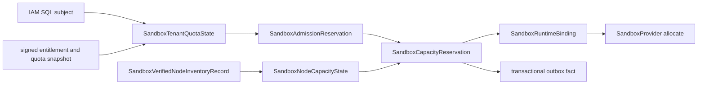

# ADR-20260729: Sandbox PostgreSQL Quota And Capacity Reservation Persistence

Status: proposed

Requirement: REQ-2026-0018

Owner: SDKWork Runtime Platform

Date: 2026-07-29

Specs: `ARCHITECTURE_DECISION_SPEC.md`, `DATABASE_SPEC.md`, `DATABASE_FRAMEWORK_SPEC.md`, `SUBJECT_ID_SPEC.md`, `MIGRATION_SPEC.md`, `SECURITY_SPEC.md`, `PRIVACY_SPEC.md`, `OBSERVABILITY_SPEC.md`, `EVENT_SPEC.md`, `PERFORMANCE_SPEC.md`, `TEST_SPEC.md`, `QUALITY_GATE_SPEC.md`

## Context

REQ-2026-0016 已要求在 Provider Allocate 前原子占用 Tenant Quota 与 Node Capacity，但当前 PostgreSQL 只持久化 `SandboxSession`、`SandboxSessionOperation`、`SandboxRuntimeBinding` 与 `SandboxSessionLease`。若每次 Admission 都聚合扫描 Reservation，锁范围和查询成本会随历史增长；若只缓存 Available Capacity，进程崩溃、重复请求或多个副本会产生超卖、Double Release 和不可审计修复。若直接复制 Commerce Entitlement 或 REQ-2026-0017 Verified Inventory，则 Sandbox 又会成为第二个身份、商业或 Node Trust 权威。

现有 Lifecycle Schema 还使用 `tenant_id TEXT`，`TenantId` 接受 Opaque String；当前 `SUBJECT_ID_SPEC.md` 要求 SQL Subject 使用正数 `BIGINT`。应用尚未发布，继续在新 Quota/Capacity Table 中复制该形状会把可关闭的预发布偏差升级成长期迁移债务。

本决策只固定候选数据、事务、恢复和评审边界，不授权 Migration 或 Runtime。

## Decision

1. PostgreSQL `authoritative-server` 是 Sandbox Cloud Quota/Capacity/Reservation 的唯一权威。Memory 只用于 Test；SQLite、Redis、Metric、Log 和 Cache 均不能替代权威状态或提供生产 Fallback。
2. 使用四个高内聚候选 Aggregate：`SandboxTenantQuotaState` 保存 Tenant Effective Limit 与 Reserved Counter；`SandboxAdmissionReservation` 保存 Tenant Quota Reservation 生命周期；`SandboxNodeCapacityState` 保存 Verified Inventory 约束下的 Node Reserved Counter；`SandboxCapacityReservation` 保存 Admission-to-Node Reservation 生命周期。物理名分别为 `sandbox_tenant_quota_state`、`sandbox_admission_reservation`、`sandbox_node_capacity_state` 与 `sandbox_capacity_reservation`。
3. Quota/Capacity State 是增量 Counter 与 CAS Authority，Reservation 是可审计事实和 Idempotency Authority。两者必须在同一事务中变化；Available 只由 Limit/Total 减 Reserved 得出，不另存可漂移字段。
4. IAM/Commerce Snapshot 只以已验证 Reference、Revision、Fingerprint 和 Validity 进入 `SandboxTenantQuotaState`/Reservation；Sandbox 不存 Raw Entitlement Payload，也不拥有 Plan、Price、Invoice、Payment。REQ-2026-0017 `SandboxVerifiedNodeInventoryRecord` 只投影 Opaque Node、Revision/Fingerprint、Capacity 与 Expiry；`SandboxNodeCapacityState` 不签发 Identity、Attestation、Health 或 Trust。
5. 第一版 `SandboxResourceVector` 使用显式 Runtime Unit、Guest vCPU、Guest Memory 和 VMM Overhead Memory Column。Workspace Storage、PID 和 IO 不混入本 Aggregate；Core Quantity 禁止只放在 Untyped JSON。新增资源维度走 Additive Contract/Migration Review。
6. 新表 SQL Subject 固定为 `tenant_id BIGINT` 正数，并从 Trusted IAM Context 解析；Sandbox Domain 变量使用 `sandbox_tenant_id`，共享类型是否继续使用 `TenantId` 由跨仓库命名评审决定。当前 TEXT Column/Identifier 必须在实施前通过独立 Migration Plan 对齐；本 ADR 不授权直接改表或改 Kernel/Agents Contract。
7. Admission 使用短事务锁定 `SandboxSessionLease`（存在时）和 `SandboxTenantQuotaState`，验证 Database Clock、Policy Revision/Fingerprint、Fencing 与 Resource Bounds，CAS Counter 并插入 `SandboxAdmissionReservation`。Commit 后才签发 Grant 或执行远程调用。
8. Capacity 使用短事务验证当前 Lease/Session/Runtime Binding/Admission/Verified Inventory，锁定 Quota/Admission/Node/Capacity Row，CAS Node Counter、绑定 Admission 并插入 `SandboxCapacityReservation`。Commit 且 Reservation 为 `confirmed` 后才允许 Provider Allocate。
9. 全局 Lock Order 为 `SandboxSessionLease -> SandboxSession -> SandboxRuntimeBinding -> SandboxTenantQuotaState -> SandboxAdmissionReservation -> SandboxNodeCapacityState -> SandboxCapacityReservation`；多 Row 按 Key 递增。持锁期间禁止 HTTP/RPC/KMS/Provider、用户交互、长计算或无界遍历。
10. `READ COMMITTED` 只在显式 Row Lock、Unique/Check Constraint 与 Conditional Update 下使用。SQLSTATE `40001`/`40P01` 只重试完整幂等事务，最多 4 次、有界 Jitter Backoff；禁止重试 Aborted Transaction 中的单条 Statement。
11. Operation/Request ID + Fingerprint 提供 Replay/Conflict，Version CAS 保护全部 Mutable Row，`SandboxFencingToken` 在每次 Counter/State Mutation 前验证。TTL 只使用 PostgreSQL Database Clock。
12. Admission State 为 `reserved/bound/released/expired/quarantined`；Capacity State 为 `prepared/confirmed/released/expired/quarantined`。`prepared` 未授权 Provider Side Effect 时可过期释放；`confirmed`/`bound` 状态不确定时必须保留 Counter 并 Quarantine，直到 Terminal Lifecycle 与 Provider Cleanup Proof 完整，禁止基于 TTL 猜测释放。
13. Release 在一个 Transaction 中按同一 Lock Order 精确递减一次 Quota/Node Counter 并 CAS State。Reconciler 使用 Primary、Tenant-leading Keyset 或声明完整语义的 `SKIP LOCKED` Claim，Batch <= 100，At-least-once 且 Idempotent；跨 Tenant Node Repair 只允许 Dedicated Scheduler Service Role 并审计。
14. Tenant Table 使用应用 Predicate 加 PostgreSQL RLS Defense-in-depth；Runtime Role 不拥有表或 `BYPASSRLS`。Owner/Migrator/Runtime/Read-only/Backup Role、TLS、Fixed Safe `search_path`、Pool/Statement/Lock/Idle-in-transaction Timeout 均显式配置。
15. Reservation Event 使用 REQ-2026-0010 Transactional Outbox；Policy Override、Quarantine、Manual Release 与 Cross-tenant Operation 写 Audit Fact。Metric/Log 不暴露 Tenant、Session、Node、Reservation、Raw Capacity/Entitlement/SQL，且不成为业务权威。
16. 生产候选目标为 Released Hot Retention 30 天、加密 Backup、至少 7 天 PITR、RPO <= 5 分钟、RTO <= 30 分钟、Restore Exercise <= 90 天。目标仍需 Human Review；Restore 后必须执行 Counter/Reservation/Lifecycle Reconciliation，Backup Job 成功不等于恢复证据。
17. `specs/sandbox-quota-and-capacity-persistence.contract.json` 是候选机器权威，保持 `draft`、`implementationAuthorized: false` 以及 no-database/migration/repository/runtime/API/SDK/deployment 标记。现有 Database Contract/Registry/Migration 不在本 Gate 0 中改变。

## Data And Transaction View

IAM/Commerce/Node Trust 提供经过验证的输入；Sandbox 只拥有 Quota/Capacity Occupancy、Reservation、Lifecycle Binding 与恢复行为。

## Alternatives

### 只保留 Reservation Ledger，每次聚合当前占用

拒绝。在线 Admission/Placement 会扫描或聚合随历史增长的数据，扩大锁、索引和 Query Plan 风险；独立 State Counter Row 提供固定锁点、O(1) Bounds Check 与 CAS，Reservation 仍保留审计事实。

### 只保存 Counter，不保存 Reservation

拒绝。无法提供 Operation Replay、Session/Binding Ownership、TTL/Quarantine、精确 Release、PITR Reconciliation 或审计链，也无法解释 Counter Drift。

### 把 Resource Vector 放入 JSONB

拒绝。Resource Quantity 是高频过滤、Constraint、Lock 和 Capacity Invariant，必须是首版 First-class Column；Untyped JSON 会弱化 Query Plan、约束和演进证据。

### 使用 PostgreSQL `SERIALIZABLE` 但不定义 Lock Order

拒绝。Serializable 不能替代 Unique/Check/CAS/Fencing 和明确锁序，并会在热点 Tenant/Node 上增加可避免的事务重试。当前选择 `READ COMMITTED` + Row Lock/Constraint/Conditional Update，并保留对 `40001`/`40P01` 的完整事务重试。

### Confirmed Reservation 到期后直接归还 Capacity

拒绝。控制器可能在 Provider Allocate 后崩溃；没有 Lifecycle 与 Cleanup Proof 就释放会把仍在运行的资源再次出售。状态不确定必须 Quarantine 并保持占用。

### 继续使用 Opaque TEXT Tenant ID

拒绝。当前 `SUBJECT_ID_SPEC.md` 明确要求 SQL Subject `BIGINT`。应用尚未上线，应先通过受评审 Migration 关闭偏差，不能让新表固化第二套 Subject 语义。

## Consequences

收益：Tenant 与 Node 热点各有单一固定锁点；Reservation 提供 Replay、Release 与恢复事实；四个对象不复制 IAM/Commerce/Node Trust；TTL 不会把不确定 Provider 资源重新出售；SQL Subject 偏差在扩散前被显式阻断。

成本：实现前必须完成跨仓库 Subject ID Migration、四表 Schema/Registry/Migration、RLS/Role、Repository Transaction Context、Outbox、Reconciler、Query Plan、PITR/Restore 与真实多副本/Firecracker 测试。Counter Row 是热点，需要基于真实负载评估连接预算、锁等待和未来 Shard/Partition 策略，但不得预优化。

## Verification

- 静态 Contract Test 验证 Authority、表/字段、Subject Blocker、Resource Vector、Transaction/Lock、CAS/Fencing、TTL/Quarantine、Query/Index、Role/RLS、Error、Event/Metric、Retention/PITR 和 No-implementation Gate。
- 真实 PostgreSQL 16/17 必须验证 Empty/Upgrade Migration、Constraint/RLS/Role、Quota/Capacity Race、Idempotency、Deadlock/Serialization、Failover、Drift、Query Plan、Backup/Restore/PITR 和 Counter Reconciliation。
- 真实 Firecracker Matrix 必须验证 Confirmed Reservation-before-Allocate、Resource Limit <= Reservation、Controller/Provider/Node Failure、Cleanup/Quarantine 与 Cross-tenant Denial。
- Public Naming、Subject Migration、IAM/Commerce/Node Trust Ownership、Database/Reliability/Security/Privacy/Operations 和 Release 均需 Human Review。

## Supersedes / Superseded By

Supersedes: none.

Superseded by: none.
