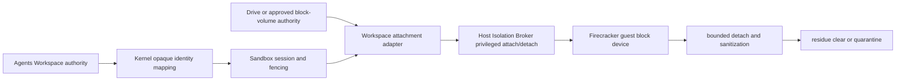

# ADR-20260729: Sandbox Workspace Block Device Attachment And Sanitization

Status: proposed

Requirement: REQ-2026-0013

Owner: SDKWork Runtime Platform

Date: 2026-07-29

Specs: `ARCHITECTURE_DECISION_SPEC.md`, `APPLICATION_LAYERED_ARCHITECTURE_SPEC.md`, `DRIVE_SPEC.md`, `SECURITY_SPEC.md`, `PRIVACY_SPEC.md`, `RUNTIME_DIRECTORY_SPEC.md`, `OBSERVABILITY_SPEC.md`, `PERFORMANCE_SPEC.md`, `TEST_SPEC.md`

## Context

Firecracker Guest 需要访问已授权 Workspace，但 `SandboxWorkspaceId` 是 Opaque Identity，不是 Host Path、Volume ID 或 Storage Credential。直接把 Host Directory 暴露给 Guest 会泄露主机布局并扩大 Symlink/Mount/TOCTOU 风险；让 Sandbox 自行创建对象存储或删除 Workspace 又会与 Agents/Drive 形成双权威。即使设备成功挂载，如果 Fencing、Encryption、Detach、Ephemeral Erase、Residue Scan 与 Quarantine 不完整，也不能声称跨 Tenant 隔离。

当前仓库只验证 Opaque Workspace ID 在 Lifecycle/Provider Request 中传递，没有生产 Attachment Adapter、Storage Backend、KMS、Block Device 或 Linux KVM Evidence。因此本决策只固定候选边界，不授权 Runtime。

## Decision

1. Service Host/Service 只依赖 provider-neutral `SandboxWorkspaceAttachmentPort`，不按 Provider 分支；Firecracker L4 Adapter 在该通用 Port 后组合候选 `SandboxWorkspaceBlockDevicePort` 与 Request/Result/Error/Grant 类型，提供 Prepare、Attach、Inspect、Detach、Sanitize Projection 五类 typed Operation。Sandbox 字段使用 `sandbox_`，未知字段关闭失败。
2. `sdkwork-agents` 拥有 Workspace Identity/Authorization/Revision/Retention/Deletion；Kernel 只映射已授权 Opaque Identity；Sandbox Service 拥有 Session/Binding/Fencing/Attachment Orchestration；L4 Adapter 只拥有 Runtime Projection；Host Isolation Broker 只执行授权的 privileged step；Firecracker Provider 只消费已验证 Attachment Result。
3. SDKWork 文件/对象存储适用时，Drive 继续拥有 Storage Provider、Object、Credential Reference、Retention 与 Deletion；Sandbox 只接受稳定 Opaque Drive/Workspace Reference 或批准的 server-side facade。若需要独立 Block-volume Authority，必须先建立独立 Ready Requirement/ADR，不能在 Sandbox Adapter 中隐式产生。
4. `SandboxWorkspaceAttachmentGrant` 短期、签名，绑定 Tenant Scope、Workspace ID/Revision、Session、Runtime Binding、Provider、Fencing、Operation、Mount Mode、Capacity、Fingerprint、Nonce 和 Expiry；验证 Replay/Revocation/Clock，不使用 Ambient Tenant/Workspace Context。
5. Firecracker 使用独立 Guest Block Device，不直接挂载 Host Directory。RootFS、Workspace、Cache、Temp 和 Secret-bearing Ephemeral Data 分离；RootFS 只读；一个候选 Attachment 最多一个 Workspace Device，不能跨活动 Tenant Binding 共享。
6. Mount Mode 固定 `ReadOnly`/`ReadWrite` 且不能超过 Grant；Filesystem/Mount Option 使用 Allowlist；Capacity 在 Attach 前执行；Guest Agent 明确确认 Mount 后才报告 Workspace Attached。
7. Workspace Projection 必须 At-rest Encrypted，Key Scope 为 Tenant + Workspace Revision + Projection。公共/持久状态只使用外部 Key Reference；Raw Key 不进入 Contract、Provider State、Telemetry/Audit Detail。Key 仅在可信 Node Boundary 解封并在 Memory 中清零；具体 KMS/Algorithm/Rotation/Revocation 需独立批准。
8. Adapter 与 Host Broker 在所有 Side Effect 前执行最高 Fencing Token 和 Idempotency；同 Operation/Fingerprint Replay，不同 Fingerprint Conflict；状态与副作用记录原子，Restart 后可恢复。
9. Readiness 同时证明 Authorization/Revision、Tenant/Session Binding、Fencing、Encryption、Integrity、Capacity、Mount Mode、Guest Acknowledgement 与 Prior Projection Residue Clear。缺一项不得将 `sandbox_workspace_attached` 置为 true。
10. Detach/Sanitize 顺序固定为 Revoke Guest Access、Flush、Guest Unmount、Device Detach、Close Encryption Mapping、Destroy Ephemeral Key Handle/Overlay/Cache/Temp、Residue Scan、Audit。Persistent Workspace Content 不由 Sandbox 擦除或删除。
11. Ephemeral Projection 使用 Cryptographic Erase；Physical Discard/Secure Erase 只有在实际 Backend Capability Evidence 存在时才可声称。任何 Sanitization/Residue Unknown 或 Failure 进入 Quarantine，阻止 Attachment/Device/Node 跨 Tenant 重用，并由有界 Reconciler 收敛。
12. Host/Device Path、Mapper/Mount Identity、Bucket/Object Key、Provider Endpoint/Credential、Presigned URL、Raw Key、Guest Credential 与 Provider-private Metadata 禁止进入公共 Result/Error/Log/Event/Metric/SDK。
13. 机器候选权威为 `specs/sandbox-workspace-block-device-attachment.contract.json`，保持 `draft`、`implementationAuthorized: false`、`x-sdkwork-no-storage-backend: true` 与 `x-sdkwork-no-kms-implementation: true`，直到人工评审和真实 KVM Evidence 完成。

## Ownership And Lifecycle View

Agents/Drive/approved Storage Authority 保留业务和存储生命周期；Sandbox 只拥有从授权 Reference 到一次 Runtime Binding 的可回收投影。

## Alternatives

### 从 `sandbox_workspace_id` 推导 Host Path

拒绝。Opaque Identity 不携带物理位置或授权语义，路径推导绕过 Agents/Storage Authority 并泄露 Host Layout。

### 直接把 Host Workspace Directory 共享给 Guest

拒绝。它扩大 Mount/Symlink/TOCTOU 与 Host Metadata 暴露，无法形成清晰的 Block Device、Quota、Encryption 和 Residue Gate。

### 在 Sandbox 中实现对象存储 Provider

拒绝。Drive 是 SDKWork 文件/对象存储 Authority；Sandbox 私建 Bucket/Object/Credential/Retention 生命周期会形成平台技术债务。

### Destroy Sandbox 时删除 Persistent Workspace

拒绝。Sandbox Runtime 生命周期不能删除 Agents-owned Business Workspace；只清理 Runtime Projection 和 Ephemeral Data。

### 只调用 Trim/Discard 即声明无残留

拒绝。底层 Backend 未证明 Secure Erase Capability 时，Discard 不是数据清除证据；需要 Cryptographic Erase、Residue Scan 和失败 Quarantine。

### Sanitization 失败后继续回池

拒绝。未知残留跨 Tenant 重用会破坏核心隔离声明，必须 Quarantine 并 Reconcile。

## Consequences

收益：Workspace 业务、存储和 Runtime Projection 各有单一权威；Firecracker 获得可验证的 Block Device/Encryption/Fencing/Readiness/Cleanup Gate；Stop/Destroy 不误删 Workspace；失败不会返回不确定资源给其他 Tenant。

成本：需要 Agents Authorization/Revision Proof、Drive 或独立 Block-volume 集成、KMS/Key 生命周期、Guest Driver/Filesystem、Host Broker、Quarantine Capacity 与真实 KVM/Storage 测试；当前 Gate 0 不能提供可挂载设备。

## Verification

- Contract Test 验证 exact operations、Sandbox 命名、Agents/Drive Ownership、Grant、Fencing、Device Boundary、At-rest Protection、Readiness、Sanitization、Residue、Quarantine、Bounds、Audit 与 Forbidden Metadata。
- 实现测试覆盖 Grant/Revision/Replay/Revocation、Stale Fencing、ReadOnly Escalation、Capacity、Integrity、Path/Device/Mount/Symlink/Hardlink/TOCTOU、Key Scope/Rotation/Revocation/Zeroization、Crash/Restart、Partial Cleanup 和 Quarantine Reconciliation。
- 真实 Linux KVM Test 使用受支持 Artifact Tuple 验证 Guest Block Device IO、ReadOnly/ReadWrite、VMM Crash、Node Restart、Detach/Sanitize、Cross-tenant Residue 和 Node Reuse Gate。
- Drive-backed/Object-backed 实现必须证明没有 Sandbox-owned Bucket/Object/Upload/Provider 生命周期；独立 Block-volume 实现必须先通过其自身 Requirement/ADR/Security/Operations Review。
- 公共命名、Data/Storage/Key Ownership、Retention、Deletion、Sanitization 和 `MicroVm` Claim 必须完成人工架构、安全、隐私、Drive/Storage 和 KVM 运维评审。

## Supersedes / Superseded By

Supersedes: none.

Superseded by: none.
