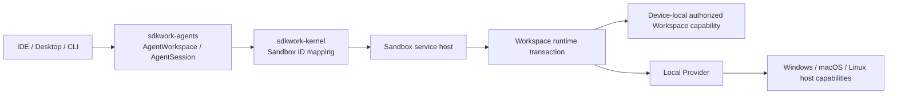
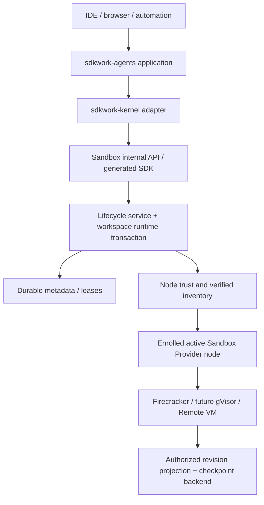
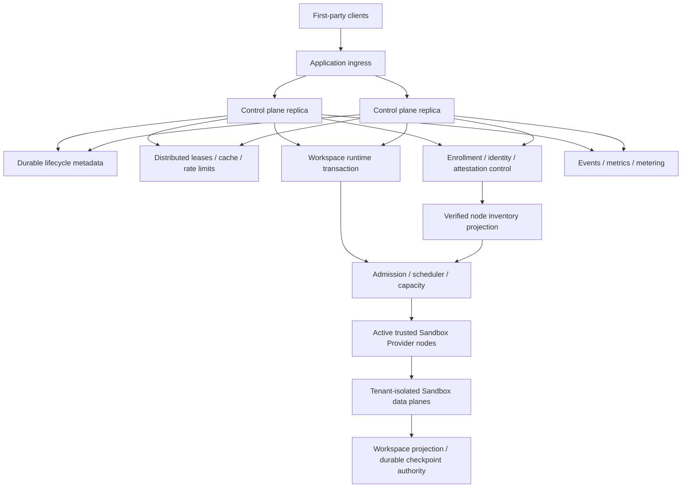

# SDKWork Sandbox Runtime Topology

Status: draft

Owner: SDKWork Runtime Platform

Updated: 2026-07-30

Parent: [Technical Architecture](TECH_ARCHITECTURE.md)

## 1. Standalone Local

Local Path 不要求 Cloud Server，但 `standalone` 与 Local Provider 只表达拓扑/执行位置，不证明全部数据位于设备。Agents Standalone 仍是 Workspace/Project/Session/Revision 业务权威，Sandbox 是 Lifecycle/Binding/Operation 权威；两者的 Server Store 保持物理位于本机且经验证的独立 PostgreSQL Authority。Kernel/BirdCoder 只有在声明 `client-local` 角色时才可使用隔离的 SQLite 存储，BirdCoder 不新建业务数据库。Workspace 使用用户授权的本地 Folder Capability 或批准的 Drive Local Adapter Capability，Sandbox Runtime Root 与 Workspace Capability 分离。

REQ-2026-0022 只为 `sandbox_standalone_local` 增加 Local Data Residency/Recovery Gate。`device-local-persistence` 默认拒绝远程持久副本，外部模型/工具处理必须另行授权和披露；`strict-device-local-processing` 进一步拒绝源码、Prompt、Transcript、Artifact、Secret 与诊断内容外传。Workspace、Service Data、Runtime Root、Cache、Log、Secret 与 Temp 使用不同的预打开 Capability；Remote Sync/Backup/Telemetry 默认拒绝。Backup 必须本地、按 PostgreSQL/SQLite 角色执行、加密敏感数据并经 Restore Test；Cleanup、Reset 与 Uninstall 默认保留 Workspace。缺少本地 Store/Capability、Corruption、Disk Full、Restore/Purge 不确定均关闭失败，不自动回退 Cloud。Source `.sdkwork/` 只属于仓库元数据，不能承载 Runtime State。

Local Provider 只承诺 `HostUser` 与显式 Capability，不承诺 Hardened Multi-tenant Isolation。Filesystem 只消费 Composition 已打开的 Capability Handle；Windows/Linux Terminal 分别等待真实 suspended Job Object 与 race-free delegated cgroup v2 Conformance，macOS 当前拒绝 Terminal 且不回退。当前 Standalone Composition 只规划 Local Provider；Docker Provider 延期，不进入依赖、Config、Capability Fallback 或 Release Claim。

## 2. Private Remote

Internal API 属于 Application-local Surface，使用锁定的 `/internal/v3/api` Prefix 和 Ingress-token Validation，默认不能暴露在 Platform API Gateway。Cloud Provider Node 必须经 REQ-2026-0017 的单次 Bootstrap、Key-bound 短期 Machine Identity、TLS 1.3 Mutual Authentication、独立 Attestation 和 Verified Inventory Gate；当前只存在 draft 契约，不存在真实 Node Agent、PKI/CA/HSM、Verifier 或 Transport Runtime。

当前优先远程 Data Plane 是真实 Linux KVM Firecracker。Docker 在 Local 与 Firecracker 完成共同 Conformance 和安全评审前保持延期；不可用的 Firecracker 不回退为 Local、Docker 或更弱 Assurance。

## 3. SaaS Cloud

Control-plane Replica 对活动 Ownership 保持 Stateless；Durable Metadata、Atomic Lease 与版本化 Node Trust/Inventory Authority 防止重复分配和过期 Node 参与调度。Data-plane Node 只有在 Identity、Attestation、Artifact、Policy、Health、Lifecycle 与 Capacity Revision 一致且新鲜时才进入 Verified Projection。REQ-2026-0019 将 Pool 拆为 tenant-neutral `PreparedSlot` 和需独立真实 KVM Evidence 的 `WarmMicroVmSlot`。REQ-2026-0021 在 Pool 之上固定 Workspace Authorization/Revision、Capacity/Claim、Attachment、Command、Checkpoint/Handoff、Detach/Sanitization 和 Release；Pool 命中不能绕过这些步骤。所有能力当前均未授权实现。

## 4. Control Plane And Data Plane

Agents Control Plane 拥有 `AgentWorkspace`/`AgentSession` 业务 Identity、Revision Authorization/Conflict/Promotion 和持久生命周期。Sandbox Control Plane 拥有 Validated Runtime Intent、`SandboxWorkspaceRuntimeTransaction`、`SandboxSession`/`SandboxRuntimeBinding`、Admission、Placement、Attachment/Writer Fencing、Checkpoint Candidate Handoff、Compensation、Recovery Decision 与 Operator Projection。Drive 或批准的 Block-volume Authority 拥有 Workspace Bytes/Candidate；Data Plane 只拥有具体 Process/VM、Workspace Projection、Network/Resource Enforcement、Terminal IO 与 Provider Observation。

Data-plane Failure 不能直接重写产品生命周期历史，只能报告 Observation，由 Control-plane Service 决定 State Transition 与 Recovery。Control Plane 也不得绕过 Provider 直接访问 Host Path 或 Process。

生命周期“历史”不得把当前 Session 热状态、幂等重放账本和 Audit/Event 流混为同一权威。现有 Repository 仍完整加载有序 Operation 历史；REQ-2026-0020 的候选目标是 bounded current-state projection + Tenant-scoped point-lookup idempotency ledger，且只在限制、保留、Late Retry、Migration 与 Kernel 行为完成人审后切换。

## 5. Placement Input

- `RuntimeCapability` 与 Sandbox Provider Feature Version。
- Requested Isolation Assurance 与 Tenant Policy。
- OS、CPU Architecture、Optional Accelerator、Toolchain Image。
- Workspace/Snapshot Locality 与 Data Residency。
- CPU、Memory、Disk、IO、PID、Port 与 Network Capacity。
- Tenant/Session/Node/Cluster Quota 与 Concurrency。
- Verified Node Identity/Attestation/Inventory Revision、Node Health、Lifecycle、Maintenance 与 Failure Domain。

没有 Candidate 满足全部 Hard Constraint 时必须拒绝。Cost 与 Locality 只能对合规 Candidate 排序，不能覆盖 Security Constraint；延期的 Warmness 不是当前 Placement Input。

## 6. Failure And Recovery

| Failure | Required Response |
| --- | --- |
| `SandboxRuntimeBinding` 前 Sandbox Provider Allocation Failure | `sandbox_operation_id` 对应 Operation 失败或重试同等级 Sandbox Provider；`SandboxSession` 不进入 Running。 |
| Node Disappears | Lease 到期；`SandboxSession` 进入 Recovering；Replacement 必须取得独占 Ownership 和有效 Checkpoint。 |
| Node Identity/Attestation/Inventory Expired Or Revoked | 立即从 Verified Projection 移除并拒绝新 Placement；按 Lifecycle Policy Drain 或 Quarantine，不能使用旧 Snapshot 继续分配。 |
| PKI/CA Or Attestation Verifier Unavailable | 新 Enrollment、Rotation 或 Verification 关闭失败；仅在仍有效且未撤销的短期证据窗口内维持既有状态，不延长 TTL 或降级 Trust Profile。 |
| Duplicate Key、Clone Or Compromise Suspected | 撤销相关 Identity，Quarantine 受影响 Node，阻止新 Side Effect，并保留不含 Raw Credential/Evidence 的 Durable Security Audit。 |
| Control-plane Replica Restart | Durable Command/Idempotency/Lease State 防止重复活动 `SandboxRuntimeBinding`。 |
| Workspace Backend Unavailable | Write Fail Closed；除非有明确 Read-only Policy，否则不使用不完整或 Stale Mount 启动。 |
| Checkpoint Or Revision Promotion Conflict | Freeze Writer；Candidate/Handoff 未耐久则 Quarantine，已耐久则释放隔离环境并由 Agents 以 CAS 处理显式冲突，不覆盖新 Revision。 |
| IDE Client Disconnect | 在有界 Reconnect Grace 内保留受 Lease/Fencing 保护的 Binding；到期后 Freeze/Drain、Checkpoint、Detach、Sanitize，不能 TTL 直接归还。 |
| Distributed Coordination Unavailable | Cloud Admission 与 Coordination-critical Operation Fail Closed；禁止 Process-local Split-brain Fallback。 |
| Event/Telemetry Sink Unavailable | 使用 Bounded Buffer/Backpressure；Audit-critical Loss 必须暴露 Degraded Status 与 Alert。 |
| Snapshot Incompatible/Corrupt | 拒绝 Restore，保留 Source Workspace，返回安全类型化 Recovery Failure。 |
| Standalone Local Store/Capability Missing Or Ambiguous | Local Residency Readiness 关闭；禁止改用远程 PostgreSQL、SQLite Server Fallback、Cloud Runtime 或未声明路径。 |
| Standalone Disk Full/Corruption/Restore/Purge Uncertain | 停止新写入并隔离受影响 Store/Binding；保留原数据与 incomplete 状态，要求显式恢复，不得静默丢弃或宣称删除完成。 |

## 7. Deployment Profile Parity

Standalone 与 Cloud 共享 `Sandbox*` Identifier、Workspace Revision/Checkpoint、`SandboxSessionState`、Operation/Compensation、Event Schema、API/SDK Type、Error Taxonomy 与 Provider Conformance。它们只允许在 Metadata Store、Cache/Coordination、Workspace Projection/Storage、Scheduler 与 `SandboxRuntimeBinding` Mechanism 上使用不同 Adapter。Local Cloud-only 阶段必须记录 Typed No-op Evidence；Deployment Profile 不能成为 L2 Business Rule Switch，也不能推导数据驻留或处理声明。Standalone Data Residency/Recovery 是 Local-only Release Gate，不传播到 Standalone/Cloud Firecracker。
