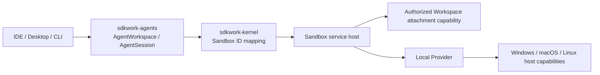
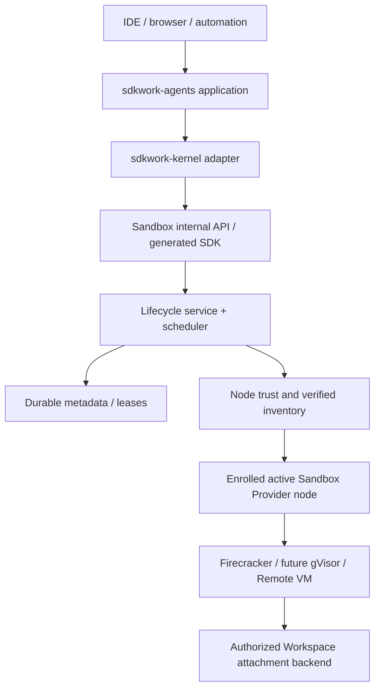
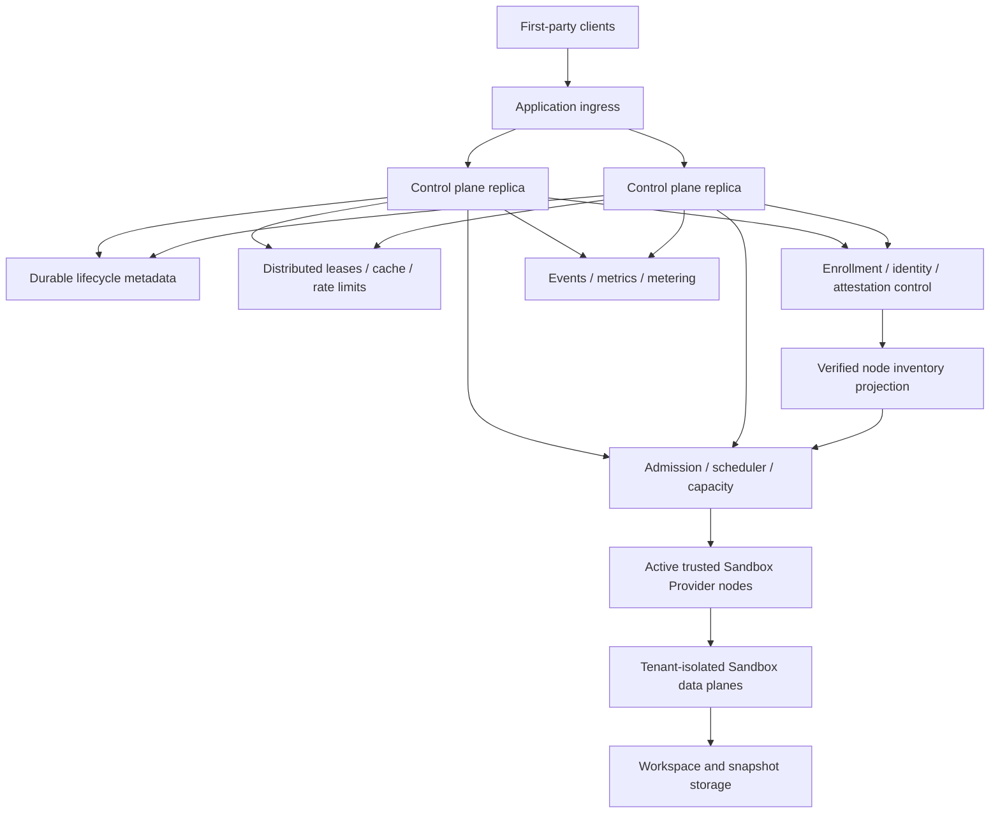

# SDKWork Sandbox Runtime Topology

Status: draft

Owner: SDKWork Runtime Platform

Updated: 2026-07-29

Parent: [Technical Architecture](TECH_ARCHITECTURE.md)

## 1. Standalone Local

Local Path 不要求服务器。Config、Data、Cache、Log、Secret 与 Temp Path 遵循 `RUNTIME_DIRECTORY_SPEC.md` 中 Application Code `sandbox` 的矩阵。Source `.sdkwork/` 只属于仓库元数据，不能承载 Runtime State。

Local Provider 提供 Host-user-level Containment 与显式 Capability，不承诺 Hardened Multi-tenant Isolation。当前 Standalone Composition 只规划 Local Provider；Docker Provider 延期，不进入依赖、Config、Capability Fallback 或 Release Claim。

## 2. Private Remote

Internal API 属于 Application-local Surface，使用锁定的 `/internal/v3/api` Prefix 和 Ingress-token Validation，默认不能暴露在 Platform API Gateway。Cloud Provider Node 必须经 REQ-2026-0017 的单次 Bootstrap、Key-bound 短期 Machine Identity、TLS 1.3 Mutual Authentication、独立 Attestation 和 Verified Inventory Gate；当前只存在 draft 契约，不存在真实 Node Agent、PKI/CA/HSM、Verifier 或 Transport Runtime。

当前优先远程 Data Plane 是真实 Linux KVM Firecracker。Docker 在 Local 与 Firecracker 完成共同 Conformance 和安全评审前保持延期；不可用的 Firecracker 不回退为 Local、Docker 或更弱 Assurance。

## 3. SaaS Cloud

Control-plane Replica 对活动 Ownership 保持 Stateless；Durable Metadata、Atomic Lease 与版本化 Node Trust/Inventory Authority 防止重复分配和过期 Node 参与调度。Data-plane Node 只有在 Identity、Attestation、Artifact、Policy、Health、Lifecycle 与 Capacity Revision 一致且新鲜时才进入 Verified Projection。Warm Pool 已明确延期，不属于当前 Cloud 正常链路；未来只有独立 Ready Requirement/ADR 和跨 Tenant Sanitization Evidence 完成后才能进入拓扑。

## 4. Control Plane And Data Plane

Agents Control Plane 拥有 `AgentWorkspace`/`AgentSession` 业务 Identity、授权和持久生命周期。Sandbox Control Plane 拥有 Validated Runtime Intent、`SandboxSession`/`SandboxSessionState`、`SandboxRuntimeBinding`、Admission、Quota、Placement、Attachment Lease/Fencing、Recovery Decision、Runtime Metadata 与 Operator Projection。Data Plane 通过 `SandboxProvider` 拥有具体 Process/VM/Container、Workspace Capability Handle、Network Namespace/Policy、Resource Enforcement、Terminal IO 与 `SandboxProviderHealth` Observation。

Data-plane Failure 不能直接重写产品生命周期历史，只能报告 Observation，由 Control-plane Service 决定 State Transition 与 Recovery。Control Plane 也不得绕过 Provider 直接访问 Host Path 或 Process。

## 5. Placement Input

- `RuntimeCapability` 与 Sandbox Provider Feature Version。
- Requested Isolation Assurance 与 Tenant Policy。
- OS、CPU Architecture、Optional Accelerator、Toolchain Image。
- Workspace/Snapshot Locality 与 Data Residency。
- CPU、Memory、Disk、IO、PID、Port 与 Network Capacity。
- Tenant/Session/Node/Cluster Quota 与 Concurrency。
- Verified Node Identity/Attestation/Inventory Revision、Node Health、Lifecycle、Maintenance 与 Failure Domain。

没有 Candidate 满足全部 Hard Constraint 时必须拒绝。Cost 与 Locality 只能对合规 Candidate 排序，不能覆盖 Security Constraint；延期的 Warmness 不是当前 Placement Input。

## 6. Failure And Recovery

| Failure | Required Response |
| --- | --- |
| `SandboxRuntimeBinding` 前 Sandbox Provider Allocation Failure | `sandbox_operation_id` 对应 Operation 失败或重试同等级 Sandbox Provider；`SandboxSession` 不进入 Running。 |
| Node Disappears | Lease 到期；`SandboxSession` 进入 Recovering；Replacement 必须取得独占 Ownership 和有效 Checkpoint。 |
| Node Identity/Attestation/Inventory Expired Or Revoked | 立即从 Verified Projection 移除并拒绝新 Placement；按 Lifecycle Policy Drain 或 Quarantine，不能使用旧 Snapshot 继续分配。 |
| PKI/CA Or Attestation Verifier Unavailable | 新 Enrollment、Rotation 或 Verification 关闭失败；仅在仍有效且未撤销的短期证据窗口内维持既有状态，不延长 TTL 或降级 Trust Profile。 |
| Duplicate Key、Clone Or Compromise Suspected | 撤销相关 Identity，Quarantine 受影响 Node，阻止新 Side Effect，并保留不含 Raw Credential/Evidence 的 Durable Security Audit。 |
| Control-plane Replica Restart | Durable Command/Idempotency/Lease State 防止重复活动 `SandboxRuntimeBinding`。 |
| Workspace Backend Unavailable | Write Fail Closed；除非有明确 Read-only Policy，否则不使用不完整或 Stale Mount 启动。 |
| Distributed Coordination Unavailable | Cloud Admission 与 Coordination-critical Operation Fail Closed；禁止 Process-local Split-brain Fallback。 |
| Event/Telemetry Sink Unavailable | 使用 Bounded Buffer/Backpressure；Audit-critical Loss 必须暴露 Degraded Status 与 Alert。 |
| Snapshot Incompatible/Corrupt | 拒绝 Restore，保留 Source Workspace，返回安全类型化 Recovery Failure。 |

## 7. Deployment Profile Parity

Standalone 与 Cloud 共享 `Sandbox*` Identifier、`SandboxSessionState`、Operation Semantics、Event Schema、API/SDK Type、Error Taxonomy 与 Sandbox Provider Conformance。它们只允许在 Metadata Store、Cache/Coordination、Workspace Storage、Scheduler 与 `SandboxRuntimeBinding` Mechanism 上使用不同 Adapter。Deployment Profile 不能成为 L2 Business Rule Switch。
