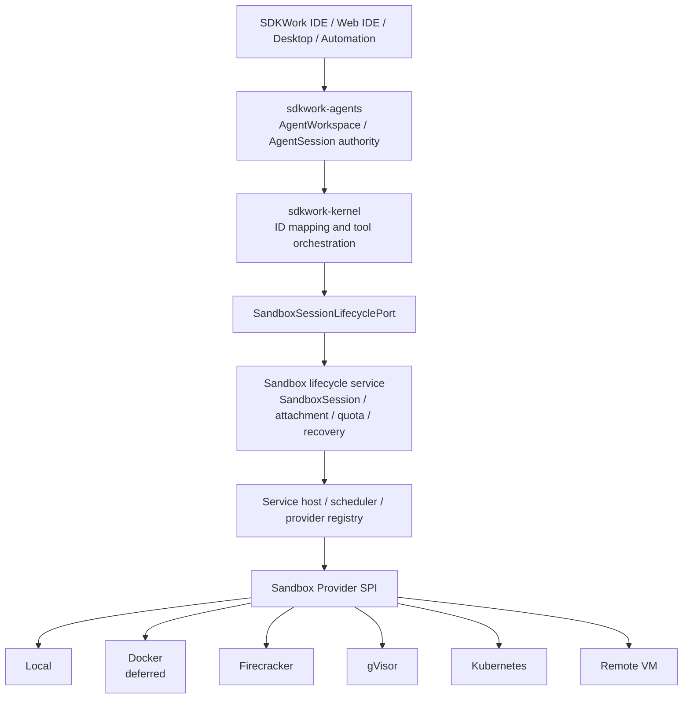

# SDKWork Sandbox Technical Architecture

Status: active

Owner: SDKWork Runtime Platform

Updated: 2026-07-29

Specs: `ARCHITECTURE_DECISION_SPEC.md`, `DOCUMENTATION_SPEC.md`, `APPLICATION_LAYERED_ARCHITECTURE_SPEC.md`, `COMPONENT_SPEC.md`, `API_SPEC.md`, `INTERNAL_API_SPEC.md`, `SECURITY_SPEC.md`, `DEPLOYMENT_SPEC.md`, `OBSERVABILITY_SPEC.md`

## 文档地图 (Document Map)

- [模块、Layer、Contract 与目录布局](TECH-modules-and-contracts.md)
- [Local、Remote 与 SaaS Runtime Topology](TECH-runtime-topology.md)
- [Security、Resource Governance、Recovery 与 Observability](TECH-security-and-operations.md)
- [Proposed Baseline ADR](../decisions/ADR-20260728-runtime-boundary-and-rust-workspace.md)
- [Proposed Lifecycle ADR](../decisions/ADR-20260728-sandbox-lifecycle-provider-spi-and-memory-store.md)
- [Proposed Local Provider Assurance ADR](../decisions/ADR-20260728-local-provider-assurance-and-host-boundaries.md)
- [Proposed Agents Workspace And Sandbox Attachment ADR](../decisions/ADR-20260728-agents-workspace-and-sandbox-attachment-ownership.md)
- [Proposed PostgreSQL Lifecycle Persistence And Reconciliation ADR](../decisions/ADR-20260728-postgresql-sandbox-lifecycle-persistence-and-reconciliation.md)
- [Proposed Sandbox Provider Allocation Key Rotation ADR](../decisions/ADR-20260728-sandbox-provider-allocation-key-rotation-and-reencryption.md)
- [Proposed Sandbox Command Execution And Terminal ADR](../decisions/ADR-20260729-sandbox-command-execution-and-terminal-boundary.md)
- [Proposed Firecracker Provider Isolation ADR](../decisions/ADR-20260729-firecracker-provider-isolation-and-node-boundaries.md)

## 1. 架构总览 (Architecture Overview)

SDKWork Sandbox 划分为 Provider-neutral Control Plane 与 Provider-specific Execution Data Plane。`sdkwork-agents` 拥有 `AgentWorkspace` 与 `AgentSession` 业务权威，`sdkwork-kernel` 将已授权身份映射为 `SandboxWorkspaceId` 与 `SandboxSessionId`，再通过 `SandboxSessionLifecyclePort` 请求 Runtime Capability 和 Sandbox Session Lifecycle Outcome。Kernel 不选择 Container、microVM、Cluster 或 Host Implementation；Sandbox Service 校验运行策略与状态，Scheduler/Composition 选择合规 Provider，Adapter 再操作具体基础设施。



稳定架构规则是：产品生命周期与安全策略位于 Sandbox Provider Mechanism 之上；Sandbox Provider 私有身份与 Host Detail 必须停留在 SPI 之下。

## 2. 技术选型 (Technology Choices)

| 关注点 | 选择 | 状态与原因 |
| --- | --- | --- |
| 主语言 | Rust 2021 Cargo Workspace | Phase 0 已启用；与 `sdkwork-kernel` 及 SDKWork Rust Service 约定一致。 |
| Async Execution | Tokio Multi-thread Runtime | Operational Async Work 开始时引入；版本只在 Root Cargo 集中声明。 |
| HTTP | `sdkwork-web-framework` Rust Crate 与标准 Axum Binding | internal-api 获批后引入；禁止 Local Framework Fork 与 Raw Listener Composition。 |
| HTTP Contract | SDKWork v3 internal-api | 计划 Authority 为 `sdkwork-intelligence-internal-api`，锁定 `/internal/v3/api/intelligence/sandbox/*`，Ingress Token Auth，生成 Internal SDK。 |
| 内部服务传输 | 优先进程内 Rust Port；仅在跨进程需求成立时引入 RPC | HTTP/RPC 若并存，Operation Semantics 必须一致。 |
| Metadata Persistence | Authoritative Sandbox Lifecycle Metadata 使用 PostgreSQL、SDKWork Database Framework 与 `sdkwork-intelligence-sandbox-repository-sqlx`；Memory Repository 仅用于测试/候选验证 | PostgreSQL Adapter 与 Database Assets 已物化，并通过临时 PostgreSQL 17 Migration/Repository/Concurrency/Recovery/Query-plan/Backup-Restore 候选验证；多副本长稳、PITR、SLO 与生产运维证据仍是 Release Gate。生产 SaaS/Server 不使用 SQLite 作为权威库。 |
| Distributed Coordination | Cloud Shared Cache、Lease、Rate Limit 与 Coordination-critical State 使用 Redis 或批准的 Distributed Adapter | 计划项；Process-local 仅限测试与明确 Single-process Standalone。 |
| Event | 版本化 Event Schema，尽可能对齐 CloudEvents Concept | 计划存放于 `apis/async/`；Terminal Stream 不等同 Durable Domain Event。 |
| Observability | Structured `tracing`、Metric、Trace Propagation 与 Append-oriented Audit | 计划项；Label 与数据分类遵循全局规范。 |
| Sandbox Provider Packaging | Native Host Process、OCI Container、microVM Image、Kubernetes Workload 或 Enrolled Remote Agent | 各 Sandbox Provider 明确 Capability 与 Assurance，不隐藏差异。 |

本表中的计划选择不会自动成为依赖。只有 Ready Requirement 与实际消费组件存在时，依赖才能进入 Build Authority。

## 3. 系统边界与模块 (System Boundaries And Modules)

当前已物化七个 Rust Crate，其中 Sandbox Provider SPI、Sandbox Lifecycle Service、Memory Repository 与 PostgreSQL Repository 已提供候选契约，Local Sandbox Provider、Service Host 与 CLI 仍保持未激活；Provider-neutral Command Executor 与 Firecracker Provider 已形成独立候选 REQ/ADR，但尚未创建公共 Rust Contract/Component，详见 [TECH-modules-and-contracts.md](TECH-modules-and-contracts.md)。输入 PRD 的 `Runtime / Session / Workspace / Sandbox / Provider` 术语保持不变；实现标识使用以下唯一映射：

| 架构关注点 | Canonical Type/Port | Canonical Rust 字段/变量 | 预留 Wire 映射 |
| --- | --- | --- | --- |
| Workspace Context | `SandboxWorkspaceId` | `sandbox_workspace_id` | `sandboxWorkspaceId` |
| Session Identity/State | `SandboxSessionId`、`SandboxSession`、`SandboxSessionState` | `sandbox_session_id`、`sandbox_session`、`sandbox_session_state` | `sandboxSessionId`、`sandboxSessionState` |
| Runtime Binding | `SandboxRuntimeBindingId`、`SandboxRuntimeBinding` | `sandbox_runtime_binding_id`、`sandbox_runtime_binding` | `sandboxRuntimeBindingId` |
| Sandbox Allocation | `SandboxId` | `sandbox_id` | `sandboxId` |
| Provider Contract | `SandboxProvider`、`SandboxProviderId`、`SandboxProviderKind`、`SandboxProviderDescriptor` | `sandbox_provider`、`sandbox_provider_id`、`sandbox_provider_kind`、`sandbox_provider_descriptor` | `sandboxProviderId`、`sandboxProviderKind` |
| Lifecycle Operation | `OperationId`、`SandboxSessionOperation` | `sandbox_operation_id`、`sandbox_session_operation` | `sandboxOperationId` |
| Lifecycle Ownership | `SandboxLeaseOwnerId`、`SandboxFencingToken`、`SandboxSessionLease` | `sandbox_lease_owner_id`、`sandbox_fencing_token`、`sandbox_session_lease` | 内部控制面契约，暂不承诺 Public Wire |
| Typed Error Boundary | `SandboxIdentifierError`、`SandboxLifecycleError`、`SandboxSessionRepositoryError` | `sandbox_identifier_error`、`sandbox_lifecycle_error`、`sandbox_session_repository_error` | 由未来 Transport Adapter 映射为标准 `ProblemDetail`，不直接序列化 Domain Error |

`TenantId`、`OperationId`、`RuntimeCapability` 与 `IsolationAssurance` 是 SDKWork 共享类型，不创建重复的 `Sandbox*` 别名；它们在有领域歧义的 Sandbox 字段/变量中使用 `sandbox_` 限定。Sandbox-owned 上下文不得使用无前缀的 `workspace_id`、`session_id`、`runtime_binding_id`、`operation_id`、`provider_id`、`lease_owner_id` 或 `fencing_token`。`SandboxProviderAllocationRef`/`sandbox_allocation_reference` 只属于 Provider 与受控持久化边界，禁止进入普通 Projection、Debug、Log、Event 或 Wire。公共错误/Result 不保留无 `Sandbox` 限定的兼容别名。架构不建立泛化的 `sdkwork-sandbox-runtime`、`sdkwork-sandbox-core`、`sdkwork-sandbox-manager` 或 `sdkwork-sandbox-backend` Crate。

Lease 竞争和丢失分别使用 `SandboxLifecycleError::LeaseUnavailable` 与 `SandboxLifecycleError::LeaseLost`。Kernel Adapter 将两者显式映射为来源为 Runtime、可重试的 `KernelErrorKind::Conflict`；`SandboxSessionRepositoryError::InvalidPageRequest` 映射为来源为 Runtime、不可重试且不泄露 Repository/Database/Crypto Detail 的 `ValidationError`；Repository 暂时不可用映射为可重试 Internal Runtime Error，持久化数据、保护器或数据库引擎完整性错误映射为不可重试且不向用户泄露细节的 Internal Runtime Error。该映射不使用通配分支。

`SandboxSessionOperation` 的持久化顺序由 Tenant+Session 内从 `0` 开始且唯一的 `sandbox_operation_sequence` 确定。Repository Restore 按该顺序重放状态机，并在 Allocation 解密前验证 State、Failure、Transient/InProgress、Binding 与 Allocation 组合；Reconciler 使用 Tenant 有序索引/SQL Keyset 与有界后继探测，只有确有下一项时才返回 `next_sandbox_session_id`。

产品边界排除 Agent Provider 行为、IAM Authentication Authority、Billing Calculation、Sandbox SDK Family 以外的 Generated Transport Ownership，以及各基础设施 Provider 自身的 Control Plane。

## 4. 目录与 Package 布局 (Directory And Package Layout)

仓库使用 `SDKWORK_WORKSPACE_SPEC.md` 的完整 Root Dictionary：`crates/` 拥有 Rust Component；`apis/` 将拥有 Author-written Contract；`sdks/` 将拥有 SDK Family 与 Generated Output；`etc/` 将拥有 Type-safe Source Config；`deployments/` 将拥有 Infrastructure/Packaging Asset；`docs/` 保存 Narrative Canon 和 Working Record；`specs/` 只保存跨组件 Machine Contract。

当前和计划布局见 [TECH-modules-and-contracts.md](TECH-modules-and-contracts.md)。

## 5. API、SDK 与数据所有权 (API, SDK, And Data Ownership)

- 当前候选实现不包含 HTTP API、RPC Service、Event Contract 或 SDK。
- 第一套 Application-local HTTP Control Surface 若获批，必须是 `internal-api`，不能使用 `backend-api` 或自定义 `/api/*` Prefix。
- Authoritative Input 位于 `apis/internal-api/intelligence/`；Materialized Authority 与 Generated Output 位于 `sdks/sdkwork-intelligence-internal-sdk/`。
- Rust Route 使用 `sdkwork-routes-sandbox-internal-api`；Host-neutral Composition 使用 `sdkwork-api-sandbox-assembly`；Standalone Listener 使用 `sdkwork-api-sandbox-standalone-gateway`。
- List/Search 必须在 Persistence/Index Boundary 分页，使用 `data.items` 与 `data.pageInfo`。
- Agents-owned Workspace File/Business Metadata、Sandbox Lifecycle Metadata、Sandbox Provider-private Allocation/Attachment Metadata、Snapshot、Log、Terminal Stream、Audit Event 与 Metric 是独立数据类别，拥有独立 Retention 与 Access Policy；Sandbox 不持久化 `AgentWorkspace` 业务记录，且不公开 `SandboxProviderAllocationRef`。
- Runtime Path 使用 Application Code `sandbox` 和 `RUNTIME_DIRECTORY_SPEC.md` 的 OS Matrix；Source Path 与 User-private Runtime Path 不能混用。

## 6. 安全、隐私与可观测性 (Security, Privacy, And Observability)

Security 由 Capability 和 Assurance 驱动。没有 Sandbox Provider 满足目标隔离时，Service 必须拒绝请求，不能静默选择更弱 Sandbox Provider。Host Filesystem、Docker Socket、Cloud Metadata、Host Network、Host SSH、Device、Elevated Capability 与 Persistent Secret 默认禁止，只有经过评审的 Profile 才能授予精确 Capability。

Terminal Output、Operational Log、Audit Record 与 Metric 使用不同 Redaction 和 Retention。安全关联使用 Server-owned `traceId`，并关联 `sandboxSessionId`、`sandboxWorkspaceId`、`sandboxId` 与 `sandboxRuntimeBindingId`；跨域关联可额外携带授权后的 `agentSessionId`/`agentWorkspaceId`，不得用无前缀变量混淆所有权。详见 [TECH-security-and-operations.md](TECH-security-and-operations.md)。

Provider-private Allocation Protection 的 Key Material 与派生 Key 使用清零载体；`sandbox_allocation_key_id` 仅允许 `1..=128` bytes printable ASCII，并由 Key Carrier、Service Domain Constructor 与 PostgreSQL Constraint 分层验证。同步 Key Source 不批准直接阻塞 Tokio 的远程 KMS 调用；生产 Composition 必须先完成人工评审的本地短生命周期 Key Handle/异步刷新边界或 Async Port 演进。

## 7. 部署与 Runtime Topology (Deployment And Runtime Topology)

- **Standalone Local：** Kernel、Lifecycle Service、Service Host 与经过评审的 Local Provider 可运行在同一台机器；Local Mode 无需服务器。Docker Provider 当前延期且不进入 Composition。
- **Private Remote：** Application Ingress/Control Plane 将工作调度到 Enrolled Provider Node 或 Kubernetes Cluster。
- **SaaS Cloud：** Stateless Control-plane Replica 使用 Durable Metadata、Distributed Coordination、Tenant Quota、Pool 与隔离 Data-plane Node。

不同 Profile 共享 Lifecycle、API、SDK、Event 与 Error Contract；只允许 Infrastructure、Persistence、Cache 与 `SandboxRuntimeBinding` Mechanism 在 Composition 层变化。详见 [TECH-runtime-topology.md](TECH-runtime-topology.md)。

## 8. 架构决策索引 (Architecture Decision Index)

| Decision | Status | Scope |
| --- | --- | --- |
| [ADR-20260728: Runtime Boundary And Rust Workspace](../decisions/ADR-20260728-runtime-boundary-and-rust-workspace.md) | proposed | Application Identity、L0-L6 Boundary、Crate Ownership 与 Kernel-to-Sandbox 依赖方向。 |
| [ADR-20260728: Sandbox Lifecycle, Provider SPI And In-memory Store](../decisions/ADR-20260728-sandbox-lifecycle-provider-spi-and-memory-store.md) | proposed | `SandboxProvider` Port、`SandboxSession` State、Idempotency、`SandboxSessionRepository` Port 与 Memory Adapter。 |
| [ADR-20260728: Local Provider Assurance And Host Boundaries](../decisions/ADR-20260728-local-provider-assurance-and-host-boundaries.md) | proposed | HostUser Assurance、Capability Root、Path/Process Boundary 与公开限制。 |
| [ADR-20260728: Agents Workspace And Sandbox Attachment Ownership](../decisions/ADR-20260728-agents-workspace-and-sandbox-attachment-ownership.md) | proposed | Agents Workspace/Session 权威、Kernel ID 映射、Sandbox Attachment 与依赖方向。 |
| [ADR-20260728: PostgreSQL Sandbox Lifecycle Persistence And Reconciliation](../decisions/ADR-20260728-postgresql-sandbox-lifecycle-persistence-and-reconciliation.md) | proposed | PostgreSQL `SandboxSession`/Operation/`SandboxRuntimeBinding` Authority、加密 Private Recovery Metadata、Lease/Fencing 与 Crash Reconciliation。 |
| [ADR-20260728: Sandbox Provider Allocation Key Rotation And Re-encryption](../decisions/ADR-20260728-sandbox-provider-allocation-key-rotation-and-reencryption.md) | proposed | Versioned Key Source、Protector 内重保护、Tenant Cursor Page、Ciphertext CAS 与旧密钥撤销门禁。 |
| [ADR-20260729: Sandbox Command Execution And Terminal Boundary](../decisions/ADR-20260729-sandbox-command-execution-and-terminal-boundary.md) | proposed | 独立 `SandboxCommandExecutor`、Typed Executable/Argv、Limit、Fencing、Result/Error 与共同 Conformance。 |
| [ADR-20260729: Firecracker Provider Isolation And Node Boundaries](../decisions/ADR-20260729-firecracker-provider-isolation-and-node-boundaries.md) | proposed | Linux KVM、Jailer、Artifact Integrity、Workspace/Network/cgroup/Vsock、Fencing 与 MicroVm Assurance。 |

Kernel Runtime Contract Authority 已固定为 Sandbox-owned `SandboxSessionLifecyclePort`，依赖方向固定为 `sdkwork-agents -> sdkwork-kernel -> sdkwork-sandbox`。PostgreSQL Lifecycle Persistence、Session Lease/Fencing、调用前 Renew、有界 Provider Timeout 与瞬态 Reconciler 已由专用 ADR 物化并通过临时 PostgreSQL 候选验证；Provider-neutral Command Execution 与 Firecracker MicroVm Boundary 已形成 proposed 决策。真实 Local/Firecracker Provider Fencing、多副本/PITR/SLO 和人工安全/架构评审仍未完成。以下工作实施前仍必须新增决策：Sandbox Attachment Storage Backend、Remote Transport Authority、跨 Tenant Scheduler Placement 与 Snapshot Portability。

## 9. 验证 (Verification)

```bash
cargo fmt --all -- --check
cargo check --workspace
cargo test --workspace
node ../sdkwork-specs/tools/check-repository-docs-standard.mjs --root .
node ../sdkwork-specs/tools/check-workspace-packages-layout.mjs --root . --mode enforce
node ../sdkwork-specs/tools/check-component-port-bindings.mjs --root .
node ../sdkwork-specs/tools/check-application-layering.mjs --root .
node ../sdkwork-specs/tools/check-identity-naming.mjs --root .
node ../sdkwork-specs/tools/audit-repository-baseline.mjs --root .
```

未来 API、SDK、Pagination、Security、Config、Topology、Persistence 与 Provider 变更必须增加其 Governing Spec 指定的专项检查。Phase 0 检查通过不代表已经存在可用 Sandbox。
