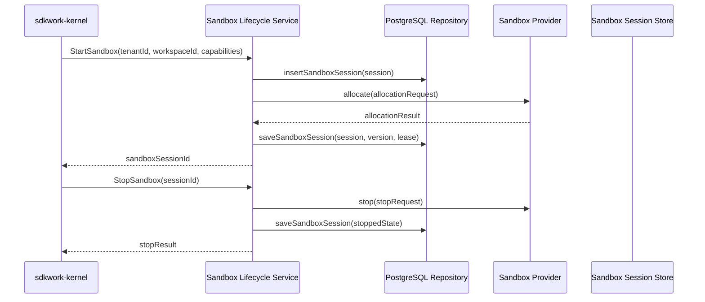
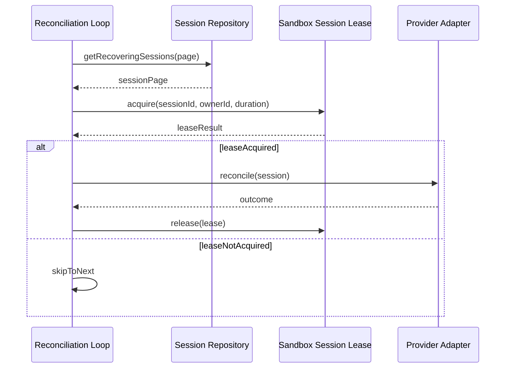
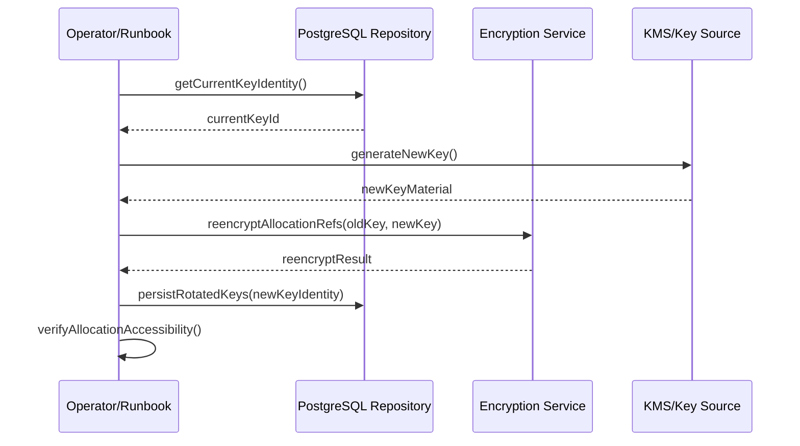
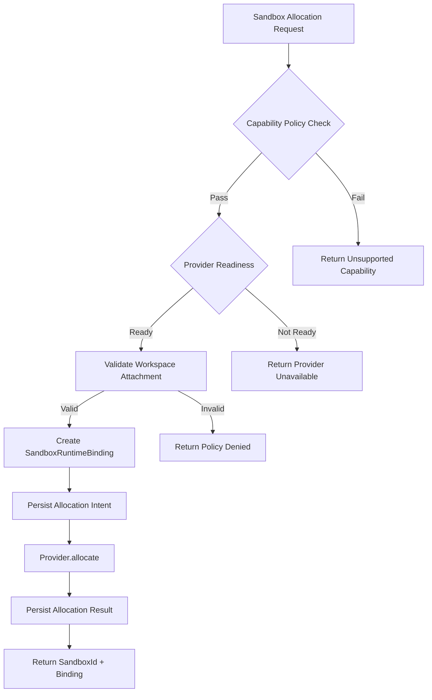
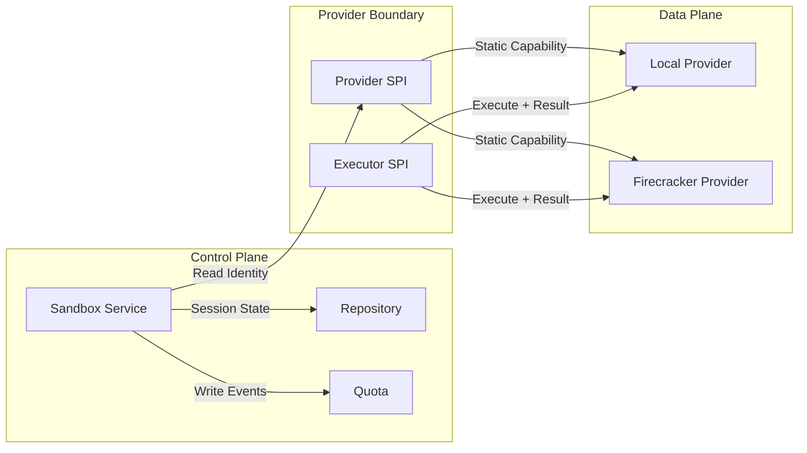
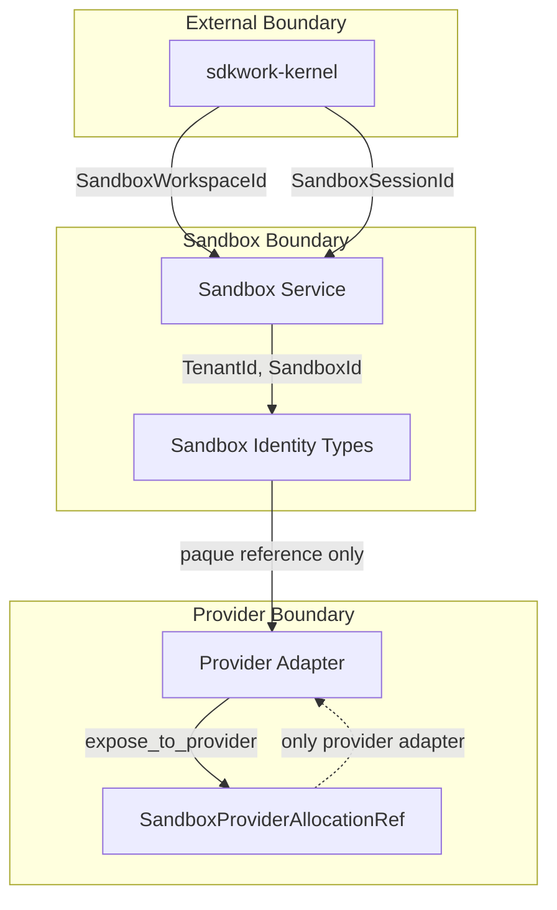

# Component Interaction Flows

Status: active

Owner: SDKWork Runtime Platform

Updated: 2026-07-29

## 目的

本视图描述已实现和计划中的组件交互流程，供架构评审时参考。

## Sandbox Session Lifecycle Flow

## Lease/Concurrency Flow

## Key Rotation Flow

## Sandbox Provider Allocation Flow

## Data Flow Boundaries

## Identity Isolation

## Security Flow Summary

| 流 | 输入 | 处理 | 输出 |
| --- | --- | --- | --- |
| Workspace Access | Capability-rooted attachment | Authority check via Kernel | SandboxWorkspaceId only |
| Provider Allocation | Tenant + capability + binding | Policy + readiness check | Opaque sandbox_id + binding |
| Command Execution | Fenced idempotent request | Fingerprint + lease + output bound | Bounded result/replay |
| Key Rotation | KMS-derived material | AES-256-GCM re-encrypt | Zeroized new identity |
| Cleanup | Destroy/stop signal | Descendant termination + residue scan | Cleanup status |

## Component Contract Map

| 调用方 | 被调用方 | 契约 | 验证方式 |
| --- | --- | --- | --- |
| Kernel | Lifecycle Service | SandboxSession API | Integration test |
| Lifecycle Service | Repository | SandboxSessionRepository trait | 33 unit tests |
| Lifecycle Service | Provider SPI | SandboxProvider trait | 5 fake boundary tests |
| Lifecycle Service | Lease Manager | Lease/Fencing | Concurrency tests |
| Reconciliation | Repository + Provider | Recovery + page | 7 reconciler tests |
| Repository (SQLx) | PostgreSQL | Migration + query | 6 unit + live PG evidence |
