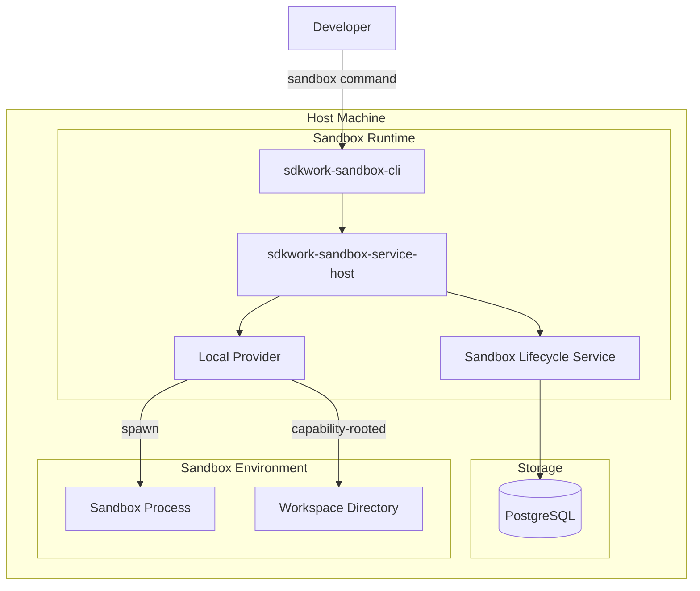
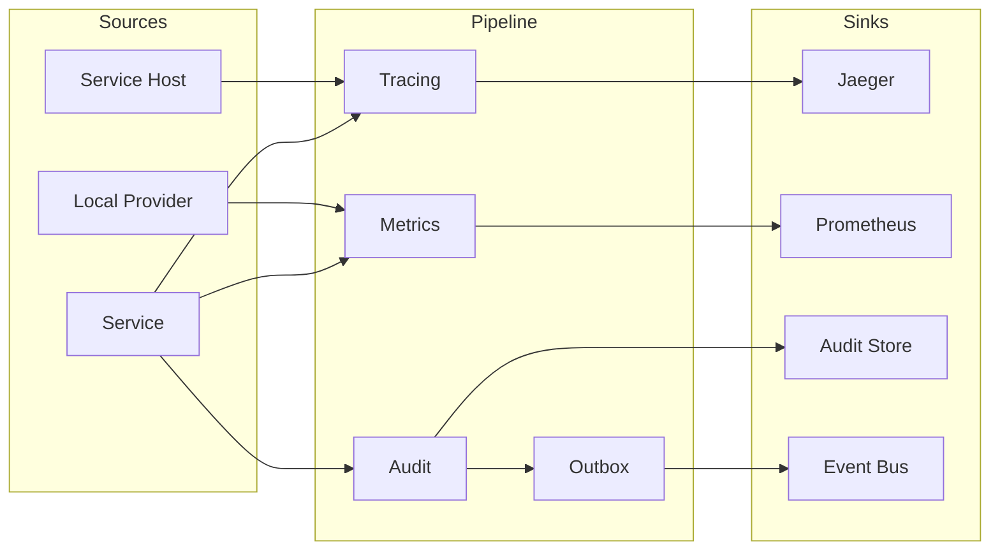

# Deployment View

Status: active

Owner: SDKWork Runtime Platform

Updated: 2026-07-29

## 目的

本视图描述 sdkwork-sandbox 的部署拓扑与运行时配置。当前仅standalone模式有设计，Cloud模式需要 REQ-2026-0017/0018/0016 批准。

## Standalone Deployment



## Runtime Dependencies

| 组件 | Standalone | Cloud | 依赖 |
| --- | --- | --- | --- |
| PostgreSQL | 必需 | 必需 | 17+ |
| Redis | 可选 | 必需 | 7+ (Coordination) |
| KMS | 必需 | 必需 | AES-256-GCM Key Management |
| Firecracker | 不支持 | 必需 (REQ-2026-0008) | Linux KVM |
| Node Agent | 不支持 | 必需 (REQ-2026-0017) | Attestation Service |

## Configuration

### Source Configuration (No Secrets)

```json
{
  "sandbox_runtime": {
    "sandbox_service_host": "127.0.0.1:8080",
    "sandbox_database_url": "env:SANDBOX_DATABASE_URL",
    "sandbox_log_level": "info",
    "sandbox_provider_poll_interval_ms": 5000
  },
  "sandbox_providers": {
    "sandbox_local": {
      "sandbox_kind": "local",
      "sandbox_assurance": "HostUser",
      "sandbox_enabled": true
    }
  }
}
```

### Runtime Directory Structure

```
${sandbox_runtime_dir}/
  sandbox_config.json          # Source config (no secrets)
  sandbox_identity/            # Node identity (Cloud only)
  sandbox_workspace/           # Capability-rooted attachments
  sandbox_tmp/                 # Bounded temp space
  sandbox_logs/                # Operational logs (no secrets)
```

## Network Boundaries

### Standalone

| 端口方向 | 地址 | 用途 | TLS |
| --- | --- | --- | --- |
| Ingress | 127.0.0.1:8080 | Internal API | Optional |
| Egress | localhost:5432 | PostgreSQL | Optional |
| Egress | - | 禁止 (默认) | - |

### Cloud (Future)

| 端口方向 | 地址 | 用途 | TLS |
| --- | --- | --- | --- |
| Ingress | 0.0.0.0:8080 | Internal API | mTLS Required |
| Ingress | 0.0.0.0:9090 | Metrics | mTLS Required |
| Egress | PostgreSQL:5432 | Repository | mTLS Required |
| Egress | Redis:6379 | Coordination | mTLS Required |
| Egress | KMS:443 | Key Operations | mTLS Required |
| Egress | - | 默认 DenyAll | - |

## Security Posture

### Standalone Security

| 层面 | 保证 | 证据 |
| --- | --- | --- |
| Workspace | Capability-rooted attachment | 类型系统 |
| Process | HostUser boundary | OS user isolation |
| Network | Default deny | 无网络代码 |
| Secret | Short-term reference | 禁止明文 |
| Cleanup | Descendant tree | Platform supervision |

### Cloud Security (Future)

| 层面 | 保证 | 证据 |
| --- | --- | --- |
| Host | MicroVm isolation | Firecracker/KVM |
| Guest | Encrypted block device | dm-crypt |
| Network | Per-binding netns/Tap | Network policy |
| Node | Attestation + verified inventory | REQ-2026-0017 |
| Tenant | Admission + quota | REQ-2026-0016/0018 |

## Observability Pipeline



## Label Redaction

所有 Metric/Trace/Audit 标签必须遵守：

- 禁止 Raw Command/Argument
- 禁止 Host Path/Device Name
- 禁止 Secret/Credential Value
- 禁止 Provider Allocation Reference 明文
- 允许: sandbox_provider_kind, sandbox_outcome, sandbox_capability 等安全标签
