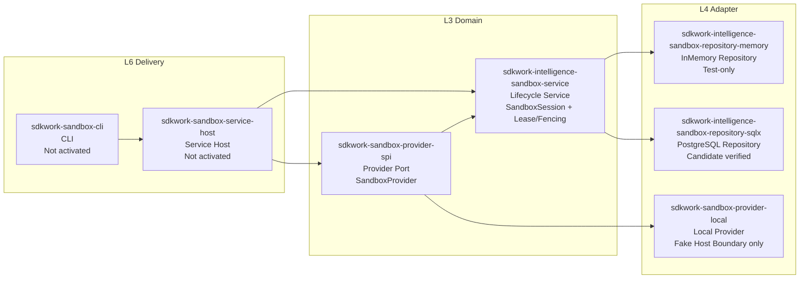

# Gate 0 Current State View

Status: active

Owner: SDKWork Runtime Platform

Updated: 2026-07-30

## 目的

本视图记录 Gate 0 阶段已物化与未物化的组件，供架构/安全评审时对照。

## 已物化 (Implemented)



## 未物化 (Deferred Until Gate 0 Exit)

```mermaid
flowchart LR
    subgraph Deferred
        CMD[SandboxCommandExecutor Port]
        FIRE[sdkwork-sandbox-provider-firecracker<br/>Firecracker Provider]
        HOST_BROKER[Host Isolation Broker]
        NET[Network Policy/Isolation]
        RES[Resource Policy/Usage]
        SCHED[Admission/Scheduler/Capacity]
        NODE[Node Trust/Attestation/Inventory]
        OBS[Observability Runtime]
        QUOTA[Quota/Capacity Persistence]
        POOL[Runtime Pool/Fast Allocation]
        TX[Workspace Runtime Transaction/Checkpoint]
        DATA[Standalone Data Residency/Recovery]
    end
```



## 组件状态矩阵

| 组件 | Crate | 状态 | 门禁证据 |
| --- | --- | --- | --- |
| Provider SPI | `sdkwork-sandbox-provider-spi` | active | `SandboxProvider` Port + Identity Types |
| Lifecycle Service | `sdkwork-intelligence-sandbox-service` | active | 26 tests, Lease/Fencing/Readiness/Idempotency |
| Memory Repository | `sdkwork-intelligence-sandbox-repository-memory` | active (test-only) | 4 tests |
| PostgreSQL Repository | `sdkwork-intelligence-sandbox-repository-sqlx` | candidate | 6 tests + live PG evidence |
| Local Provider | `sdkwork-sandbox-provider-local` | gate-0 | 5 Fake Host Boundary tests |
| Service Host | `sdkwork-sandbox-service-host` | inactive | 21-test Bootstrap/Profile/Capability Gate 0 contracts only; no wiring |
| CLI | `sdkwork-sandbox-cli` | inactive | Stub only |

## 门禁契约状态

| 契约 | 路径 | 状态 |
| --- | --- | --- |
| Provider Delivery Gates | `specs/sandbox-provider-delivery-gates.contract.json` | draft, implementationAuthorized: false |
| Local Host Boundary | `specs/sandbox-local-provider-host-boundary.contract.json` | draft, implementationAuthorized: false |
| Command Contract | `apis/commands/sandbox-command-contract.json` | draft |
| Service Host Composition | `crates/sdkwork-sandbox-service-host/specs/sandbox-service-host-composition.contract.json` | draft, implementationAuthorized: false; all referenced Profile/Capability dependencies closed |
| Firecracker Artifact | `specs/sandbox-firecracker-artifact-compatibility.contract.json` | draft |
| Network Isolation | `specs/sandbox-firecracker-network-isolation.contract.json` | draft |
| Resource Isolation | `specs/sandbox-firecracker-resource-isolation.contract.json` | draft |
| Host Isolation Broker | `specs/sandbox-host-isolation-broker.contract.json` | draft |
| Multi-tenant Scheduling | `specs/sandbox-multi-tenant-scheduling.contract.json` | draft |
| Node Trust | `specs/sandbox-node-trust-and-inventory.contract.json` | draft |
| Quota Persistence | `specs/sandbox-quota-and-capacity-persistence.contract.json` | draft |
| Runtime Pool | `specs/sandbox-runtime-pool.contract.json` | draft |
| Lifecycle History/Idempotency | `specs/sandbox-lifecycle-history-and-idempotency.contract.json` | draft, implementationAuthorized: false |
| Workspace Runtime Transaction | `specs/sandbox-workspace-runtime-transaction.contract.json` | draft, implementationAuthorized: false |
| Standalone Data Residency | `specs/sandbox-standalone-data-residency.contract.json` | draft, implementationAuthorized: false; Local-only release evidence gate |

## 需求状态

| REQ | 标题 | 状态 |
| --- | --- | --- |
| REQ-2026-0001 | Foundation | accepted |
| REQ-2026-0002 | Lifecycle Core | accepted |
| REQ-2026-0003 | Local Provider | draft |
| REQ-2026-0004 | Agents Workspace Attachment | accepted |
| REQ-2026-0005 | PostgreSQL Repository | accepted |
| REQ-2026-0006 | Key Rotation | accepted |
| REQ-2026-0007 | Command Execution | draft |
| REQ-2026-0008 | Firecracker Provider | draft |
| REQ-2026-0009 | Service Host | draft |
| REQ-2026-0010 | Observability | draft |
| REQ-2026-0011 | Host Isolation Broker | draft |
| REQ-2026-0012 | Firecracker Artifact | draft |
| REQ-2026-0013 | Workspace Block Device | draft |
| REQ-2026-0014 | Network Isolation | draft |
| REQ-2026-0015 | Resource Isolation | draft |
| REQ-2026-0016 | Multi-tenant Admission | draft |
| REQ-2026-0017 | Node Trust | draft |
| REQ-2026-0018 | Quota Persistence | draft |
| REQ-2026-0019 | Runtime Pool And Fast Allocation | draft |
| REQ-2026-0020 | Lifecycle Hot State And Idempotency Retention | draft |
| REQ-2026-0021 | Workspace Runtime Transaction And Checkpoint | draft |
| REQ-2026-0022 | Standalone Data Residency And Recovery | draft |

## 验证门禁

```bash
cargo fmt --all -- --check
cargo check --workspace
cargo test --workspace
cargo clippy --workspace --all-targets -- -D warnings
node --test tests/contract/*.test.mjs
node ../sdkwork-specs/tools/check-repository-docs-standard.mjs --root .
node ../sdkwork-specs/tools/check-workspace-packages-layout.mjs --root . --mode enforce
node ../sdkwork-specs/tools/check-component-port-bindings.mjs --root . --strict
node ../sdkwork-specs/tools/check-application-layering.mjs --root .
node ../sdkwork-specs/tools/check-identity-naming.mjs --root .
node ../sdkwork-specs/tools/audit-repository-baseline.mjs --root .
```

上述 Phase 0 Repository Baseline 在 2026-07-30 通过。Service Host 现要求 18 个 Gate 依赖，其中 Workspace Runtime Transaction 是 Local/Cloud 公共关闭失败依赖，Standalone Data Residency/Recovery 只适用于 `sandbox_standalone_local` 并在 Firecracker Profiles 中禁止；聚焦测试还覆盖 Local/Cold/Pool 分离、Revision/Checkpoint 顺序、Command/Terminal 条件门禁，以及 11 类 Local 数据、数据库角色、Capability 分离、无隐式传输、Backup/Restore 和 Purge。完整验证数字以 PLAN-2026-0002 当前 Checkpoint 为准。Provider、Service Host、Cloud、Pool、Local Data Claim 与商业 Release Gate 仍因 `implementationAuthorized: false` 和待人工评审保持关闭；不得把 Baseline PASS 解释为运行时或发布就绪。
