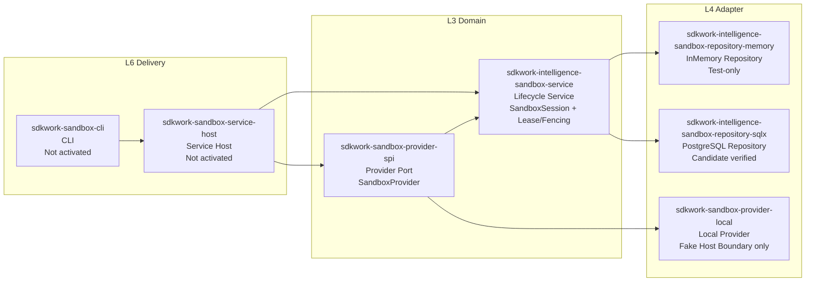
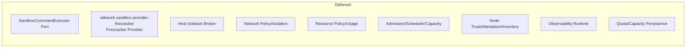

# Gate 0 Current State View

Status: active

Owner: SDKWork Runtime Platform

Updated: 2026-07-29

## 目的

本视图记录 Gate 0 阶段已物化与未物化的组件，供架构/安全评审时对照。

## 已物化 (Implemented)



## 未物化 (Deferred Until Gate 0 Exit)



## 组件状态矩阵

| 组件 | Crate | 状态 | 门禁证据 |
| --- | --- | --- | --- |
| Provider SPI | `sdkwork-sandbox-provider-spi` | active | `SandboxProvider` Port + Identity Types |
| Lifecycle Service | `sdkwork-intelligence-sandbox-service` | active | 22 tests, Lease/Fencing/Readiness |
| Memory Repository | `sdkwork-intelligence-sandbox-repository-memory` | active (test-only) | 4 tests |
| PostgreSQL Repository | `sdkwork-intelligence-sandbox-repository-sqlx` | candidate | 6 tests + live PG evidence |
| Local Provider | `sdkwork-sandbox-provider-local` | gate-0 | 5 Fake Host Boundary tests |
| Service Host | `sdkwork-sandbox-service-host` | inactive | Contract only |
| CLI | `sdkwork-sandbox-cli` | inactive | Stub only |

## 门禁契约状态

| 契约 | 路径 | 状态 |
| --- | --- | --- |
| Provider Delivery Gates | `specs/sandbox-provider-delivery-gates.contract.json` | draft, implementationAuthorized: false |
| Command Contract | `apis/commands/sandbox-command-contract.json` | draft |
| Service Host Composition | `specs/sandbox-service-host-composition.contract.json` | draft |
| Firecracker Artifact | `specs/sandbox-firecracker-artifact-compatibility.contract.json` | draft |
| Network Isolation | `specs/sandbox-firecracker-network-isolation.contract.json` | draft |
| Resource Isolation | `specs/sandbox-firecracker-resource-isolation.contract.json` | draft |
| Host Isolation Broker | `specs/sandbox-host-isolation-broker.contract.json` | draft |
| Multi-tenant Scheduling | `specs/sandbox-multi-tenant-scheduling.contract.json` | draft |
| Node Trust | `specs/sandbox-node-trust-and-inventory.contract.json` | draft |
| Quota Persistence | `specs/sandbox-quota-and-capacity-persistence.contract.json` | draft |

## 需求状态

| REQ | 标题 | 状态 |
| --- | --- | --- |
| REQ-2026-0001 | Foundation | accepted |
| REQ-2026-0002 | Lifecycle Core | accepted |
| REQ-2026-0003 | Local Provider | draft |
| REQ-2026-0004 | Agents Workspace Attachment | accepted |
| REQ-2026-0005 | PostgreSQL Repository | accepted |
| REQ-2026-0006 | Key Rotation | accepted |
| REQ-2026-0007 | Command Execution | draft |
| REQ-2026-0008 | Firecracker Provider | draft |
| REQ-2026-0009 | Service Host | draft |
| REQ-2026-0010 | Observability | draft |
| REQ-2026-0011 | Host Isolation Broker | draft |
| REQ-2026-0012 | Firecracker Artifact | draft |
| REQ-2026-0013 | Workspace Block Device | draft |
| REQ-2026-0014 | Network Isolation | draft |
| REQ-2026-0015 | Resource Isolation | draft |
| REQ-2026-0016 | Multi-tenant Admission | draft |
| REQ-2026-0017 | Node Trust | draft |
| REQ-2026-0018 | Quota Persistence | draft |

## 验证门禁

```bash
cargo fmt --all -- --check
cargo check --workspace
cargo test --workspace
cargo clippy --workspace --all-targets -- -D warnings
node --test tests/contract/*.test.mjs
node ../sdkwork-specs/tools/check-repository-docs-standard.mjs --root .
node ../sdkwork-specs/tools/check-workspace-packages-layout.mjs --root . --mode enforce
node ../sdkwork-specs/tools/check-component-port-bindings.mjs --root . --strict
node ../sdkwork-specs/tools/check-application-layering.mjs --root .
node ../sdkwork-specs/tools/check-identity-naming.mjs --root .
node ../sdkwork-specs/tools/audit-repository-baseline.mjs --root .
```

所有门禁通过 (2026-07-29)。
