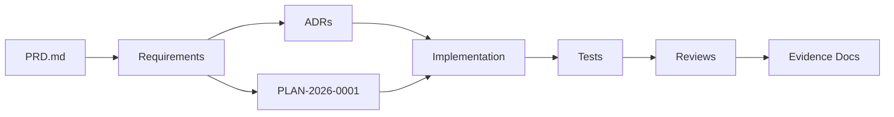

# Requirement Traceability Map

Status: active

Owner: SDKWork Runtime Platform

Updated: 2026-07-29

## 目的

本视图追踪从 PRD 到 REQ/ADR 再到实现与验证证据的对应关系，供评审时确认闭环。

## Traceability Chain

## 已闭环 (Closed)

| PRD 能力 | REQ | ADR | 实现 | 测试 | 评审证据 |
| --- | --- | --- | --- | --- | --- |
| Runtime Boundary | REQ-2026-0001 | ADR-20260728-runtime-boundary-and-rust-workspace | Workspace layout + Cargo.toml | Repository baseline audit | REVIEW-20260728-sandbox-foundation-verification |
| Lifecycle Core | REQ-2026-0002 | ADR-20260728-sandbox-lifecycle-provider-spi-and-memory-store | service crate (22 tests) | cargo test + clippy | REVIEW-20260728-sandbox-lifecycle-core-verification |
| Workspace Attachment | REQ-2026-0004 | ADR-20260728-agents-workspace-and-sandbox-attachment-ownership | SandboxWorkspaceId type | identity tests | REVIEW-20260728-sandbox-workspace-attachment-boundary-verification |
| PostgreSQL Repository | REQ-2026-0005 | ADR-20260728-postgresql-sandbox-lifecycle-persistence-and-reconciliation | sqlx repository + migration | 6 unit tests + live PG evidence | REVIEW-20260728-sandbox-postgresql-persistence-verification |
| Key Rotation | REQ-2026-0006 | ADR-20260728-sandbox-provider-allocation-key-rotation-and-reencryption | reencryption module + runbook | unit tests + live PG evidence | REVIEW-20260729-sandbox-provider-allocation-key-rotation-verification |

## 待人工评审 (Pending Human Review)

| REQ | ADR | 评审文档 | 门禁 |
| --- | --- | --- | --- |
| REQ-2026-0003 Local Provider | ADR-20260728-local-provider-assurance-and-host-boundaries | REVIEW-20260729-local-provider-architecture-security | Gate 0 Fake Host Boundary only |
| REQ-2026-0007 Command Execution | ADR-20260729-sandbox-command-execution-and-terminal-boundary | REVIEW-20260729-sandbox-command-execution-architecture-security | Draft contract only |
| REQ-2026-0008 Firecracker Provider | ADR-20260729-firecracker-provider-isolation-and-node-boundaries | REVIEW-20260729-firecracker-provider-architecture-security | Draft contract only |
| REQ-2026-0009 Service Host | ADR-20260729-sandbox-service-host-composition-and-readiness | REVIEW-20260729-sandbox-service-host-composition-and-readiness | Draft contract only |
| REQ-2026-0010 Observability | ADR-20260729-sandbox-observability-event-audit-outbox-boundary | REVIEW-20260729-sandbox-observability-event-audit-outbox | Draft contract only |
| REQ-2026-0011 Host Isolation Broker | ADR-20260729-sandbox-host-isolation-broker-boundary | REVIEW-20260729-sandbox-host-isolation-broker | Draft contract only |
| REQ-2026-0012 Firecracker Artifact | ADR-20260729-sandbox-firecracker-artifact-compatibility-and-supply-chain | REVIEW-20260729-sandbox-firecracker-artifact-compatibility-and-supply-chain | Draft contract only |
| REQ-2026-0013 Workspace Block Device | ADR-20260729-sandbox-workspace-block-device-attachment-and-sanitization | REVIEW-20260729-sandbox-workspace-block-device-attachment-and-sanitization | Draft contract only |
| REQ-2026-0014 Network Isolation | ADR-20260729-sandbox-firecracker-network-isolation-and-egress-policy | REVIEW-20260729-sandbox-firecracker-network-isolation | Draft contract only |
| REQ-2026-0015 Resource Isolation | ADR-20260729-sandbox-firecracker-resource-isolation-and-usage-facts | REVIEW-20260729-sandbox-firecracker-resource-isolation | Draft contract only |
| REQ-2026-0016 Multi-tenant Admission | ADR-20260729-sandbox-multi-tenant-admission-scheduling-and-capacity-reservation | REVIEW-20260729-sandbox-multi-tenant-admission-scheduling-and-capacity | Draft contract only |
| REQ-2026-0017 Node Trust | ADR-20260729-sandbox-node-trust-enrollment-attestation-and-inventory | REVIEW-20260729-sandbox-node-trust-enrollment-attestation-and-inventory | Draft contract only |
| REQ-2026-0018 Quota Persistence | ADR-20260729-sandbox-postgresql-quota-and-capacity-reservation-persistence | REVIEW-20260729-sandbox-postgresql-quota-and-capacity-persistence | Draft contract only |

## 验证证据索引

| 证据文档 | 路径 | 覆盖 REQ |
| --- | --- | --- |
| Foundation Verification | `docs/engineering/reviews/REVIEW-20260728-sandbox-foundation-verification.md` | REQ-2026-0001 |
| Lifecycle Core Verification | `docs/engineering/reviews/REVIEW-20260728-sandbox-lifecycle-core-verification.md` | REQ-2026-0002 |
| Workspace Attachment Verification | `docs/engineering/reviews/REVIEW-20260728-sandbox-workspace-attachment-boundary-verification.md` | REQ-2026-0004 |
| PostgreSQL Persistence Verification | `docs/engineering/reviews/REVIEW-20260728-sandbox-postgresql-persistence-verification.md` | REQ-2026-0005 |
| Key Rotation Verification | `docs/engineering/reviews/REVIEW-20260729-sandbox-provider-allocation-key-rotation-verification.md` | REQ-2026-0006 |
| Local Provider Architecture Security | `docs/engineering/reviews/REVIEW-20260729-local-provider-architecture-security.md` | REQ-2026-0003 |
| Command Execution Architecture Security | `docs/engineering/reviews/REVIEW-20260729-sandbox-command-execution-architecture-security.md` | REQ-2026-0007 |
| Firecracker Provider Architecture Security | `docs/engineering/reviews/REVIEW-20260729-firecracker-provider-architecture-security.md` | REQ-2026-0008 |
| Service Host Composition | `docs/engineering/reviews/REVIEW-20260729-sandbox-service-host-composition-and-readiness.md` | REQ-2026-0009 |
| Observability Event Audit Outbox | `docs/engineering/reviews/REVIEW-20260729-sandbox-observability-event-audit-outbox.md` | REQ-2026-0010 |
