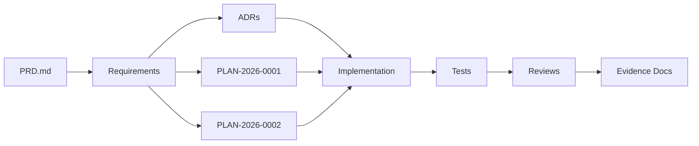

# Requirement Traceability Map

Status: active

Owner: SDKWork Runtime Platform

Updated: 2026-08-01

## 目的

本视图追踪从 PRD 到 REQ/ADR 再到实现与验证证据的对应关系，供评审时确认闭环。

## Traceability Chain

## 已实现候选边界 (Implemented Candidates)

下列条目已有实现或验证候选，但除 Foundation 外仍受对应 ADR/人工评审和生产证据约束；本表不等同于 Provider 或商业 Release 闭环。

| PRD 能力 | REQ | ADR | 实现 | 测试 | 评审证据 |
| --- | --- | --- | --- | --- | --- |
| Runtime Boundary | REQ-2026-0001 | ADR-20260728-runtime-boundary-and-rust-workspace | Workspace layout + Cargo.toml | Repository baseline audit | REVIEW-20260728-sandbox-foundation-verification |
| Lifecycle Core | REQ-2026-0002 | ADR-20260728-sandbox-lifecycle-provider-spi-and-memory-store | service crate (33 tests) | cargo test + clippy | REVIEW-20260728-sandbox-lifecycle-core-verification |
| Workspace Attachment | REQ-2026-0004 | ADR-20260728-agents-workspace-and-sandbox-attachment-ownership | SandboxWorkspaceId type | identity tests | REVIEW-20260728-sandbox-workspace-attachment-boundary-verification |
| PostgreSQL Repository | REQ-2026-0005 | ADR-20260728-postgresql-sandbox-lifecycle-persistence-and-reconciliation | sqlx repository + migration | 9 unit tests + live PG evidence | REVIEW-20260728-sandbox-postgresql-persistence-verification |
| Key Rotation | REQ-2026-0006 | ADR-20260728-sandbox-provider-allocation-key-rotation-and-reencryption | reencryption module + runbook | unit tests + live PG evidence | REVIEW-20260729-sandbox-provider-allocation-key-rotation-verification |

## 待人工评审 (Pending Human Review)

| REQ | ADR | 评审文档 | 门禁 |
| --- | --- | --- | --- |
| REQ-2026-0003 Local Provider | ADR-20260728-local-provider-assurance-and-host-boundaries | REVIEW-20260729-local-provider-architecture-security | Fake Host Boundary + draft Local Host machine contract/test only; no Host runtime |
| REQ-2026-0007 Command Execution | ADR-20260729-sandbox-command-execution-and-terminal-boundary | REVIEW-20260729-sandbox-command-execution-architecture-security | Draft contract only |
| REQ-2026-0008 Firecracker Provider | ADR-20260729-firecracker-provider-isolation-and-node-boundaries | REVIEW-20260729-firecracker-provider-architecture-security | Draft contract only |
| REQ-2026-0009 Service Host | ADR-20260729-sandbox-service-host-composition-and-readiness | REVIEW-20260729-sandbox-service-host-composition-and-readiness | Draft Bootstrap + Profile/Capability contracts, 21 static tests; all runtime/materialization gates closed |
| REQ-2026-0010 Observability | ADR-20260729-sandbox-observability-event-audit-outbox-boundary | REVIEW-20260729-sandbox-observability-event-audit-outbox | Draft contract only |
| REQ-2026-0011 Host Isolation Broker | ADR-20260729-sandbox-host-isolation-broker-boundary | REVIEW-20260729-sandbox-host-isolation-broker | Draft contract only |
| REQ-2026-0012 Firecracker Artifact | ADR-20260729-sandbox-firecracker-artifact-compatibility-and-supply-chain | REVIEW-20260729-sandbox-firecracker-artifact-compatibility-and-supply-chain | Draft contract only |
| REQ-2026-0013 Workspace Block Device | ADR-20260729-sandbox-workspace-block-device-attachment-and-sanitization | REVIEW-20260729-sandbox-workspace-block-device-attachment-and-sanitization | Draft contract only |
| REQ-2026-0014 Network Isolation | ADR-20260729-sandbox-firecracker-network-isolation-and-egress-policy | REVIEW-20260729-sandbox-firecracker-network-isolation | Draft contract only |
| REQ-2026-0015 Resource Isolation | ADR-20260729-sandbox-firecracker-resource-isolation-and-usage-facts | REVIEW-20260729-sandbox-firecracker-resource-isolation | Draft contract only |
| REQ-2026-0016 Multi-tenant Admission | ADR-20260729-sandbox-multi-tenant-admission-scheduling-and-capacity-reservation | REVIEW-20260729-sandbox-multi-tenant-admission-scheduling-and-capacity | Draft contract only |
| REQ-2026-0017 Node Trust | ADR-20260729-sandbox-node-trust-enrollment-attestation-and-inventory | REVIEW-20260729-sandbox-node-trust-enrollment-attestation-and-inventory | Draft contract only |
| REQ-2026-0018 Quota Persistence | ADR-20260729-sandbox-postgresql-quota-and-capacity-reservation-persistence | REVIEW-20260729-sandbox-postgresql-quota-and-capacity-persistence | Draft contract only |
| REQ-2026-0019 Runtime Pool | ADR-20260730-sandbox-runtime-pool-claim-and-sanitization | REVIEW-20260730-sandbox-runtime-pool-architecture-security | Draft machine contract/test only; no runtime |
| REQ-2026-0020 Lifecycle History/Idempotency | ADR-20260730-sandbox-lifecycle-hot-state-and-idempotency-ledger | REVIEW-20260730-sandbox-lifecycle-history-and-idempotency-retention | Draft machine contract/test only; no schema or runtime change |
| REQ-2026-0021 Workspace Runtime Transaction | ADR-20260730-sandbox-workspace-runtime-transaction-and-checkpoint | REVIEW-20260730-sandbox-workspace-runtime-transaction-architecture-security | Draft end-to-end composition contract/test only; no runtime or cross-repository change |
| REQ-2026-0022 Standalone Data Residency | ADR-20260730-sandbox-standalone-data-residency-and-recovery | REVIEW-20260730-sandbox-standalone-data-residency-and-recovery | Draft Local-only evidence contract/test; no database, runtime, recovery or cross-repository change |
| REQ-2026-0023 Internal Control Plane | ADR-20260731-sandbox-internal-control-plane | REVIEW-20260731-sandbox-internal-control-plane | Draft in-process/internal-RPC parity contract/test; no Port, Proto, SDK, transport runtime, discovery, deployment or Kernel change |
| REQ-2026-0024 Interactive Terminal Session | ADR-20260731-sandbox-interactive-terminal-session | REVIEW-20260731-sandbox-interactive-terminal-session | Draft capability/session/stream/containment contract/test; no PTY, process, guest stream, SDK/API, persistence, Provider or cross-repository change |
| REQ-2026-0025 Runtime Secret Projection | ADR-20260801-sandbox-runtime-secret-projection | REVIEW-20260801-sandbox-runtime-secret-projection | Draft value-free grant/projection/rotation/revocation/cleanup contract/test; no Secret Authority, value transport, process projection, SDK/API, Provider or cross-repository change |
| REQ-2026-0026 Cloud Data Residency/Recovery | ADR-20260801-sandbox-cloud-data-residency-and-recovery | REVIEW-20260801-sandbox-cloud-data-residency-and-recovery | Draft Cloud data inventory/region/replication/backup/PITR/recovery/export/delete contract/test; no storage adapter, replication, backup worker, restore controller, deployment or cross-repository change |
| REQ-2026-0027 Cross-Repository Version Compatibility | ADR-20260801-sandbox-cross-repository-version-compatibility | REVIEW-20260801-sandbox-cross-repository-version-compatibility | Draft immutable four-repository release-set, compatibility/preflight, rollout/drain/rollback/downgrade/support-window contract/test; no release authority, registry, SDK/proto/artifact publication, migration, deployment or cross-repository change |

## Commercial Release Gate

[REVIEW-20260731 Sandbox Commercial Readiness Gap Audit](../../engineering/reviews/REVIEW-20260731-sandbox-commercial-readiness-gap-audit.md) and `specs/sandbox-commercial-readiness.contract.json` aggregate the cross-repository release decision without replacing any REQ, ADR, owner review, or real-environment evidence. The current derived decision is `NO-GO`; the gate identifies six blocked delivery slices and five missing ready contract boundaries.

## 验证证据索引

| 证据文档 | 路径 | 覆盖 REQ |
| --- | --- | --- |
| Foundation Verification | `docs/engineering/reviews/REVIEW-20260728-sandbox-foundation-verification.md` | REQ-2026-0001 |
| Lifecycle Core Verification | `docs/engineering/reviews/REVIEW-20260728-sandbox-lifecycle-core-verification.md` | REQ-2026-0002 |
| Workspace Attachment Verification | `docs/engineering/reviews/REVIEW-20260728-sandbox-workspace-attachment-boundary-verification.md` | REQ-2026-0004 |
| PostgreSQL Persistence Verification | `docs/engineering/reviews/REVIEW-20260728-sandbox-postgresql-persistence-verification.md` | REQ-2026-0005 |
| Key Rotation Verification | `docs/engineering/reviews/REVIEW-20260729-sandbox-provider-allocation-key-rotation-verification.md` | REQ-2026-0006 |
| Local Provider Architecture Security | `docs/engineering/reviews/REVIEW-20260729-local-provider-architecture-security.md` | REQ-2026-0003 |
| Command Execution Architecture Security | `docs/engineering/reviews/REVIEW-20260729-sandbox-command-execution-architecture-security.md` | REQ-2026-0007 |
| Firecracker Provider Architecture Security | `docs/engineering/reviews/REVIEW-20260729-firecracker-provider-architecture-security.md` | REQ-2026-0008 |
| Service Host Composition | `docs/engineering/reviews/REVIEW-20260729-sandbox-service-host-composition-and-readiness.md` | REQ-2026-0009 |
| Observability Event Audit Outbox | `docs/engineering/reviews/REVIEW-20260729-sandbox-observability-event-audit-outbox.md` | REQ-2026-0010 |
| Lifecycle History And Idempotency Retention | `docs/engineering/reviews/REVIEW-20260730-sandbox-lifecycle-history-and-idempotency-retention.md` | REQ-2026-0020 |
| Workspace Runtime Transaction Architecture Security | `docs/engineering/reviews/REVIEW-20260730-sandbox-workspace-runtime-transaction-architecture-security.md` | REQ-2026-0021 |
| Standalone Data Residency And Recovery | `docs/engineering/reviews/REVIEW-20260730-sandbox-standalone-data-residency-and-recovery.md` | REQ-2026-0022 |
| Runtime Secret Projection | `docs/engineering/reviews/REVIEW-20260801-sandbox-runtime-secret-projection.md` | REQ-2026-0025 |
| Cloud Data Residency And Recovery | `docs/engineering/reviews/REVIEW-20260801-sandbox-cloud-data-residency-and-recovery.md` | REQ-2026-0026 |
| Cross-Repository Version Compatibility | `docs/engineering/reviews/REVIEW-20260801-sandbox-cross-repository-version-compatibility.md` | REQ-2026-0027 |
